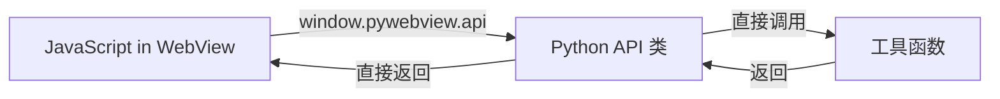

# 架构对比：后端实现 vs HTTP Bridge vs PyWebView

## 三种架构的本质区别

### 1. 后端实现（xiaozhi-server）


**执行位置**: **远程服务器**（xiaozhi-server 所在机器）

**特点**:
- ✅ 统一管理所有设备
- ✅ 适合多设备调度
- ❌ 工具运行在远程服务器，不在 MR 设备本地
- ❌ 需要网络连接到 xiaozhi-server
- ❌ 延迟较高（网络往返 + 服务器处理）

**用途**: 云端服务、多设备管理、统一调度

---

### 2. HTTP Bridge（本地 MCP HTTP 服务）


**执行位置**: **MR 设备本地**（127.0.0.1）

**特点**:
- ✅ 工具运行在 MR 设备本地（不依赖远程服务器）
- ✅ 延迟低（无网络往返，仅本地 HTTP）
- ✅ 可复用现有 MCP 工具定义（mcp_function_calling_definition.py）
- ✅ tools.js 无需修改（兼容现有 executeHiPandaTool）
- ❌ 需要单独启动 HTTP 服务

**用途**: MR 设备独立运行、离线工具调用、低延迟需求

**关键区别**: 
- **后端实现**: Browser → **远程** xiaozhi-server → 执行工具
- **HTTP Bridge**: Browser → **本地** MCP HTTP Bridge → 执行工具

---

### 3. PyWebView（Python 应用内嵌浏览器）



**执行位置**: **MR 设备本地**（同一 Python 进程）

**特点**:
- ✅ 无 HTTP 开销，最低延迟（<1ms）
- ✅ JavaScript 直接调用 Python 函数
- ✅ 易于打包成独立应用
- ❌ 需要重构为 PyWebView 应用
- ❌ 不适合纯浏览器环境

**用途**: MR 设备独立应用、最低延迟、无网络环境

---

## 核心差异对比表

| 对比项 | 后端实现 | HTTP Bridge | PyWebView |
|--------|---------|-------------|-----------|
| **执行位置** | 远程服务器 | MR 设备本地 | MR 设备本地 |
| **通信方式** | WebSocket | HTTP (localhost) | 进程内调用 |
| **延迟** | 100-500ms | 10-50ms | <1ms |
| **网络依赖** | 需要连接服务器 | 无需网络 | 无需网络 |
| **工具定义** | server_plugins/ | mcp_function_calling_definition.py | Python 类方法 |
| **独立运行** | ❌ 依赖服务器 | ✅ 独立运行 | ✅ 独立运行 |
| **复用 MCP** | ✅ | ✅ | ❌ (需手动转换) |
| **启动方式** | 启动 xiaozhi-server | 启动 HTTP 服务 | 启动 PyWebView 应用 |

---

## mcp_function_calling_definition.py 的实现方式

### 当前实现（FastMCP stdio）

```python
from mcp.server.fastmcp import FastMCP
server = FastMCP("Local Agent Helper")

@server.tool()
def load_protocol_from_library(library_name: str=None, protocol_name: str=None) -> str:
    """Load a specified MRI protocol."""
    return f"{inspect.currentframe().f_code.co_name} called by mcp server."

# 启动方式
server.run(transport="stdio")  # 通过 stdin/stdout 通信
```

**特点**:
- 使用 FastMCP 框架
- 通过 `@server.tool()` 装饰器定义工具
- stdio 模式：通过标准输入/输出与外部进程通信
- **无法直接被 tools.js 调用**（tools.js 在浏览器中，无法访问 stdio）

### 如何与 tools.js 对接？

#### 方案 1: HTTP Bridge（推荐 ✨）

使用 `mcp_http_bridge.py`（已创建）:

```bash
# 1. 启动 HTTP Bridge
cd /home/tester/AI_Tool/xiaozhi-esp32-server_sdk/main/xiaozhi-server/MR_MCP_Tool/py
python3 mcp_http_bridge.py

# 输出:
# [MCP HTTP Bridge] 已加载 20 个 MCP 工具
#   - load_protocol_from_library
#   - select_task_or_series
#   - start_scan
#   ...
# [MCP HTTP Bridge] 监听地址: http://127.0.0.1:8765
```

```javascript
// 2. tools.js 自动调用（无需修改代码）
const result = await executeMcpTool('load_protocol_from_library', {
    library_name: 'ge',
    protocol_name: 'Brain Routine'
});

console.log(result);
// 输出: {
//   success: true,
//   result: "load_protocol_from_library called by mcp server.",
//   tool: "load_protocol_from_library",
//   timestamp: "2026-01-21T10:30:00",
//   device: "MCP HTTP Bridge (MR Device)"
// }
```

#### 方案 2: 转换为 PyWebView API

将 MCP 工具转换为 PyWebView API 类：

```python
class HiPandaAPI:
    def load_protocol_from_library(self, library_name=None, protocol_name=None):
        """Load a specified MRI protocol."""
        return f"load_protocol_from_library called, library={library_name}, protocol={protocol_name}"

# JavaScript 调用
const result = await window.pywebview.api.load_protocol_from_library('ge', 'Brain Routine');
```

---

## 推荐架构选择

### 场景 1: MR 设备独立运行 + 复用现有 MCP 工具

**推荐**: **HTTP Bridge** ✨

```bash
python3 py/mcp_http_bridge.py
```

- ✅ 直接复用 `mcp_function_calling_definition.py` 的 20+ 工具
- ✅ tools.js 无需修改（兼容现有代码）
- ✅ 工具运行在 MR 设备本地（不依赖远程服务器）
- ✅ 低延迟（10-50ms）

### 场景 2: 最低延迟 + 独立应用

**推荐**: **PyWebView**

```bash
python3 hiPanda_webview.py
```

- ✅ 最低延迟（<1ms）
- ✅ 可打包成独立应用
- ❌ 需要手动将 MCP 工具转换为 Python 类方法

### 场景 3: 多设备统一管理 + 云端调度

**推荐**: **后端实现**（xiaozhi-server 插件）

- ✅ 统一管理所有设备
- ✅ 云端调度和协调
- ❌ 工具不在设备本地执行
- ❌ 需要网络连接

---

## 快速测试 HTTP Bridge

```bash
# 1. 启动服务
cd /home/tester/AI_Tool/xiaozhi-esp32-server_sdk/main/xiaozhi-server/MR_MCP_Tool/py
python3 mcp_http_bridge.py

# 2. 测试健康检查
curl http://127.0.0.1:8765/health

# 3. 获取工具列表
curl http://127.0.0.1:8765/tools/list

# 4. 调用工具
curl -X POST http://127.0.0.1:8765/tools/call \
  -H "Content-Type: application/json" \
  -d '{
    "name": "load_protocol_from_library",
    "arguments": {
      "library_name": "ge",
      "protocol_name": "Brain Routine"
    }
  }'

# 预期输出:
# {
#   "success": true,
#   "result": "load_protocol_from_library called by mcp server.",
#   "tool": "load_protocol_from_library",
#   "arguments": {"library_name": "ge", "protocol_name": "Brain Routine"},
#   "timestamp": "2026-01-21T10:30:00.123456",
#   "device": "MCP HTTP Bridge (MR Device)"
# }
```

---

## 总结

### 核心差异

| 方案 | 工具执行位置 | 是否依赖远程服务器 | 延迟 |
|------|------------|------------------|------|
| **后端实现** | xiaozhi-server 所在机器（远程） | ✅ 必须依赖 | 100-500ms |
| **HTTP Bridge** | MR 设备本地（127.0.0.1） | ❌ 完全独立 | 10-50ms |
| **PyWebView** | MR 设备本地（进程内） | ❌ 完全独立 | <1ms |

### 最佳选择

**对于你的 MR 设备场景 + 复用现有 MCP 工具**：

👉 **使用 HTTP Bridge (`mcp_http_bridge.py`)**

- 工具运行在 MR 设备本地（不是远程服务器！）
- 直接复用 `mcp_function_calling_definition.py` 的所有工具
- tools.js 无需修改（已兼容）
- 独立运行，无需 xiaozhi-server

```bash
# 启动即用
python3 py/mcp_http_bridge.py
```
