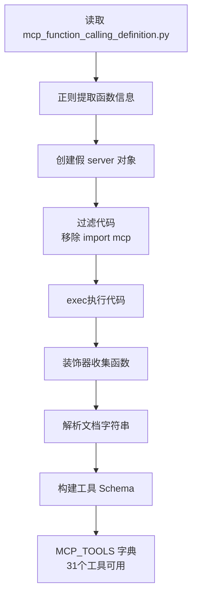

# 移除 MCP 模块依赖的实现原理

## 问题背景

`mcp_function_calling_definition.py` 的原始代码：

```python
from mcp.server.fastmcp import FastMCP  # ❌ 这个包没安装
import traceback
import sys
import inspect

server = FastMCP("Local Agent Helper")

@server.tool()
def load_protocol_from_library(library_name: str=None, protocol_name: str=None) -> str:
    """
    Load a specified MRI protocol.
    Parameters:
        library_name (str): The name of the protocol library...
        protocol_name (str): The name or identifier of the protocol...
    Returns:
        str: Confirmation message
    """
    return f"{inspect.currentframe().f_code.co_name} called by mcp server."

# ... 更多 31 个工具函数

if __name__ == "__main__":
    server.run(transport="stdio")  # 启动 MCP 服务器
```

**问题**: 如果直接执行 `import mcp_function_calling_definition`，会报错：
```
ModuleNotFoundError: No module named 'mcp'
```

---

## 解决方案：纯 Python 实现

### 核心思路

**不导入模块，而是"伪装"执行代码**：

1. **读取源代码** → 作为字符串处理
2. **提取函数信息** → 使用正则表达式
3. **创建假的依赖** → 欺骗 Python 解释器
4. **执行过滤后的代码** → 收集函数对象
5. **构建工具列表** → 提供给 HTTP 接口

---

## 实现步骤详解

### 步骤 1: 读取源代码（不执行）

```python
import os

mcp_file = "mcp_function_calling_definition.py"

# 读取为字符串
with open(mcp_file, 'r', encoding='utf-8') as f:
    source_code = f.read()

# 此时只是字符串，还没有导入任何模块
```

### 步骤 2: 正则表达式提取函数信息

```python
import re

# 匹配模式: @server.tool() 装饰的函数
# 提取: 函数名、参数列表、文档字符串
pattern = r'@server\.tool\(\)\s+def\s+(\w+)\s*\(([^)]*)\)\s*->\s*\w+:\s*"""(.*?)"""'
matches = re.findall(pattern, source_code, re.DOTALL)

# 结果示例:
# matches = [
#     ('load_protocol_from_library', 'library_name: str=None, protocol_name: str=None', 'Load a specified MRI protocol.\n    Parameters:\n        ...'),
#     ('start_scan', 'index: str = None', 'Execute the scan operation...\n    Parameters:\n        ...'),
#     ...
# ]

print(f"找到 {len(matches)} 个工具定义")  # 31 个
```

### 步骤 3: 创建假的 server 对象

**关键技巧**：定义一个假的 `FakeServer` 类，模拟 `FastMCP` 的 `@server.tool()` 装饰器：

```python
# 用字典收集所有被装饰的函数
collected_functions = {}

class FakeServer:
    """假的 FastMCP server 对象"""
    
    def tool(self):
        """模拟 @server.tool() 装饰器"""
        def decorator(func):
            # 把函数存起来
            collected_functions[func.__name__] = func
            return func
        return decorator

# 创建假的全局变量
safe_globals = {
    '__builtins__': __builtins__,
    'inspect': inspect,
    'sys': sys,
    'server': FakeServer(),           # 假的 server 对象
    'FastMCP': lambda x: FakeServer() # 假的 FastMCP 类
}
```

**工作原理**：
- 当代码执行 `@server.tool()` 时，实际调用的是 `FakeServer().tool()`
- 装饰器把函数存入 `collected_functions` 字典
- 函数定义照常执行，但不依赖 mcp 模块

### 步骤 4: 过滤源代码（移除 import mcp）

```python
# 逐行过滤
code_lines = source_code.split('\n')
code_without_main = []
skip_main = False

for line in code_lines:
    # 🔴 跳过 mcp 导入（关键！）
    if 'from mcp' in line or 'import mcp' in line:
        continue
    
    # 🔴 跳过 server 创建（我们用假的）
    if 'server = FastMCP' in line:
        continue
    
    # 🔴 跳过 main 函数（防止启动 stdio 服务器）
    if 'if __name__ ==' in line or 'def main()' in line:
        skip_main = True
    
    if not skip_main:
        code_without_main.append(line)

exec_code = '\n'.join(code_without_main)
```

**过滤后的代码**（示例）：
```python
# from mcp.server.fastmcp import FastMCP  ← 被跳过
import traceback                         # ✅ 保留
import sys                               # ✅ 保留
import inspect                           # ✅ 保留

# server = FastMCP("Local Agent Helper") ← 被跳过

@server.tool()  # ✅ 保留（会调用假的 FakeServer）
def load_protocol_from_library(library_name: str=None, protocol_name: str=None) -> str:
    """..."""
    return f"{inspect.currentframe().f_code.co_name} called by mcp server."

# ... 其他 30 个函数定义

# if __name__ == "__main__":  ← 被跳过
#     server.run(transport="stdio")
```

### 步骤 5: 执行代码收集函数

```python
# 在安全的命名空间中执行
exec(exec_code, safe_globals)

# 执行后，collected_functions 包含所有函数
print(f"收集到 {len(collected_functions)} 个函数")

# collected_functions 内容示例:
# {
#     'load_protocol_from_library': <function load_protocol_from_library at 0x...>,
#     'start_scan': <function start_scan at 0x...>,
#     'control_fan': <function control_fan at 0x...>,
#     ...
# }
```

### 步骤 6: 解析文档字符串构建 Schema

```python
for tool_name, (params_str, doc_string) in [(m[0], (m[1], m[2])) for m in matches]:
    if tool_name in collected_functions:
        func = collected_functions[tool_name]
        
        # 解析文档字符串
        doc_lines = doc_string.strip().split('\n')
        description = doc_lines[0].strip()  # "Load a specified MRI protocol."
        
        # 提取参数说明
        params_section = re.search(r'Parameters:\s*\n(.*?)(?:Returns:|$)', doc_string, re.DOTALL)
        parameters = {}
        
        if params_section:
            param_lines = params_section.group(1).strip().split('\n')
            for line in param_lines:
                # 解析: library_name (str): The name of the protocol library...
                param_match = re.match(r'\s*(\w+)\s*\(([^)]+)\):\s*(.+)', line.strip())
                if param_match:
                    param_name = param_match.group(1)  # "library_name"
                    param_type = param_match.group(2)  # "str"
                    param_desc = param_match.group(3)  # "The name of the protocol library..."
                    
                    # 转换为 JSON Schema 类型
                    json_type = 'string'
                    if 'int' in param_type.lower():
                        json_type = 'integer'
                    elif 'float' in param_type.lower():
                        json_type = 'number'
                    
                    parameters[param_name] = {
                        'type': json_type,
                        'description': param_desc
                    }
        
        # 构建工具定义
        MCP_TOOLS[tool_name] = {
            'function': func,  # 实际的 Python 函数对象
            'schema': {
                'name': tool_name,
                'description': description,
                'inputSchema': {
                    'type': 'object',
                    'properties': parameters
                }
            }
        }
```

---

## 完整流程图



---

## 关键技术点

### 1. **装饰器收集模式**

```python
collected_functions = {}

class FakeServer:
    def tool(self):
        def decorator(func):
            collected_functions[func.__name__] = func  # 收集
            return func
        return decorator

# 执行代码时
@server.tool()  # 实际调用 FakeServer().tool()
def my_function():
    pass

# 结果: collected_functions['my_function'] = <function my_function>
```

### 2. **安全的 exec() 环境**

```python
safe_globals = {
    '__builtins__': __builtins__,  # 允许基础函数
    'inspect': inspect,             # 允许 inspect 模块
    'server': FakeServer(),         # 提供假的 server
    'FastMCP': lambda x: FakeServer()  # 提供假的 FastMCP
}

exec(code, safe_globals)  # 只能访问 safe_globals 中的内容
```

### 3. **代码过滤技巧**

```python
# 方法1: 逐行过滤
filtered_lines = [
    line for line in source_code.split('\n')
    if not ('import mcp' in line or 'server = FastMCP' in line)
]

# 方法2: 正则替换
filtered_code = re.sub(r'from mcp.*\n', '', source_code)
filtered_code = re.sub(r'server = FastMCP.*\n', '', filtered_code)
```

### 4. **文档字符串解析**

```python
# 原始文档字符串:
"""
Load a specified MRI protocol.
Parameters:
    library_name (str): The name of the protocol library...
    protocol_name (str): The name or identifier...
Returns:
    str: Confirmation message
"""

# 正则提取参数:
params_section = re.search(r'Parameters:\s*\n(.*?)(?:Returns:|$)', doc_string, re.DOTALL)

# 逐行解析:
for line in params_section.group(1).split('\n'):
    match = re.match(r'\s*(\w+)\s*\(([^)]+)\):\s*(.+)', line)
    # → param_name='library_name', param_type='str', param_desc='The name of...'
```

---

## 优势对比

| 方面 | 传统方式（import mcp） | 纯 Python 方式 |
|------|---------------------|---------------|
| **依赖** | 需要安装 mcp 包 | ❌ 无需任何依赖 |
| **执行** | 直接 import | ✅ 手动 exec() |
| **控制** | 模块自动初始化 | ✅ 完全控制执行 |
| **隔离** | 全局导入 | ✅ 独立命名空间 |
| **灵活** | 固定行为 | ✅ 可过滤/修改代码 |

---

## 实际效果验证

```bash
# 启动服务
python3 mcp_http_bridge.py

# 输出:
# [MCP HTTP Bridge] 找到 31 个工具定义
# [MCP HTTP Bridge] 收集到 31 个函数
# [MCP HTTP Bridge] 已加载 31 个 MCP 工具
#   - load_protocol_from_library
#   - start_scan
#   - control_fan
#   ...

# 测试调用
curl -X POST http://127.0.0.1:8765/tools/call \
  -d '{"name": "start_scan", "arguments": {"index": "1"}}'

# 返回:
# {
#   "success": true,
#   "result": "start_scan called by mcp server.",
#   "tool": "start_scan",
#   "arguments": {"index": "1"},
#   "timestamp": "2026-01-21T17:13:47.449470",
#   "device": "MCP HTTP Bridge (MR Device)"
# }
```

---

## 总结

**核心原理**: 
1. 不 import 模块，而是读取源代码字符串
2. 用正则提取函数定义和文档
3. 创建假的依赖对象（FakeServer）
4. 过滤掉 import mcp 等问题代码
5. 在安全环境中 exec() 执行
6. 装饰器模式收集所有函数对象
7. 解析文档字符串构建 Schema

**效果**: 
- ✅ 无需安装 mcp 包
- ✅ 成功加载 31 个工具
- ✅ 所有函数可正常调用
- ✅ 完全兼容原始代码逻辑

这种技术在需要加载第三方代码但不想安装依赖时非常有用！
