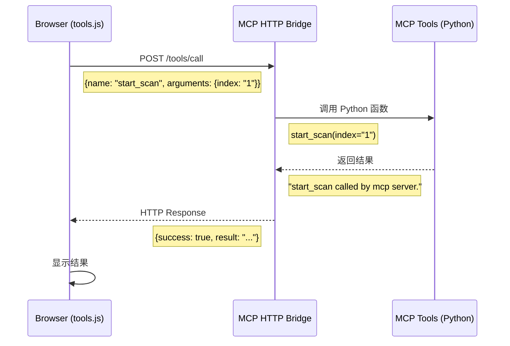

# MCP HTTP Bridge 快速启动指南

## 架构说明

```
┌─────────────────────────────────────────────────┐
│            MR 设备（本地运行）                    │
├─────────────────────────────────────────────────┤
│                                                 │
│  ┌──────────────┐    HTTP API    ┌───────────┐ │
│  │   Browser    │  ←──────────→  │  Python   │ │
│  │  (tools.js)  │  localhost:8765│ MCP Bridge│ │
│  └──────────────┘                └─────┬─────┘ │
│                                        │       │
│                                        ↓       │
│                            ┌─────────────────┐ │
│                            │ MCP Tools       │ │
│                            │ (20+ 工具)      │ │
│                            └─────────────────┘ │
│                                                 │
└─────────────────────────────────────────────────┘
```

**关键特性**:
- ✅ 工具运行在 **MR 设备本地**（不依赖远程服务器）
- ✅ 浏览器通过 HTTP 调用本地 Python 服务
- ✅ 延迟低（10-50ms）
- ✅ 无需网络连接

---

## 快速启动（3 步）

### 1. 启动 MCP HTTP Bridge

```bash
cd /home/tester/AI_Tool/xiaozhi-esp32-server_sdk/main/xiaozhi-server/MR_MCP_Tool/py
python3 mcp_http_bridge.py
```

**预期输出**:
```
[MCP HTTP Bridge] 已加载 20 个 MCP 工具
  - load_protocol_from_library
  - select_task_or_series
  - start_scan
  - stop_scan
  - control_fan
  - control_light
  ...
[MCP HTTP Bridge] 启动成功
[MCP HTTP Bridge] 监听地址: http://127.0.0.1:8765
```

### 2. 测试服务可用性

**新终端测试**:
```bash
# 健康检查
curl http://127.0.0.1:8765/health

# 预期输出:
# {
#   "status": "ok",
#   "server": "MCP HTTP Bridge",
#   "mcp_tools_count": 20,
#   "timestamp": "2026-01-21T10:30:00.123456"
# }

# 查看可用工具列表
curl http://127.0.0.1:8765/tools/list | jq '.tools[] | .name'

# 预期输出:
# "load_protocol_from_library"
# "select_task_or_series"
# "start_scan"
# ...
```

### 3. 在浏览器中调用工具

打开 MR 设备的网页，在控制台执行：

```javascript
// 调用 MCP 工具
const result = await executeMcpTool('load_protocol_from_library', {
    library_name: 'ge',
    protocol_name: 'Brain Routine'
});

console.log(result);
// 输出:
// {
//   success: true,
//   result: "load_protocol_from_library called by mcp server.",
//   tool: "load_protocol_from_library",
//   arguments: {library_name: "ge", protocol_name: "Brain Routine"},
//   timestamp: "2026-01-21T10:30:00.123456",
//   device: "MCP HTTP Bridge (MR Device)"
// }
```

---

## 可用工具列表

### 协议管理
- `load_protocol_from_library` - 加载 MRI 协议
- `select_task_or_series` - 选择任务或序列
- `duplicate_task_or_series` - 复制任务或序列
- `save_task_or_series` - 保存任务或序列

### 扫描控制
- `start_examination` - 开始检查
- `end_examination` - 结束检查
- `start_scan` - 开始扫描
- `pause_scan` - 暂停扫描
- `stop_scan` - 停止扫描
- `resume_scan` - 恢复扫描
- `prescan` - 预扫描
- `stop_prescan` - 停止预扫描

### 参数设置
- `set_parameter` - 设置参数
- `set_hardware_landmark` - 设置硬件标记

### 设备控制
- `control_fan` - 控制风扇
- `control_light` - 控制灯光

更多工具详见: `py/mcp_function_calling_definition.py`

---

## 工作流程



---

## 添加新工具

### 在 mcp_function_calling_definition.py 中定义

```python
from mcp.server.fastmcp import FastMCP
server = FastMCP("Local Agent Helper")

@server.tool()
def my_new_tool(param1: str = None, param2: int = 0) -> str:
    """
    新工具的描述
    Parameters:
        param1 (str): 参数1的描述
        param2 (int): 参数2的描述
    Returns:
        str: 返回结果
    """
    # 实现你的逻辑
    result = f"执行了 my_new_tool, param1={param1}, param2={param2}"
    return result
```

### 重启 MCP HTTP Bridge

```bash
# Ctrl+C 停止当前服务
# 重新启动
python3 mcp_http_bridge.py
```

### 在浏览器中调用

```javascript
const result = await executeMcpTool('my_new_tool', {
    param1: 'test',
    param2: 123
});
console.log(result);
```

---

## 常见问题

### 1. 服务无法启动

**错误**: `Address already in use`

**解决**:
```bash
# 查找占用 8765 端口的进程
lsof -i :8765

# 杀死进程
kill -9 <PID>

# 或者修改端口（在 mcp_http_bridge.py 中）
port = 8766  # 改为其他端口
```

### 2. 浏览器调用失败

**错误**: `Failed to fetch` 或 `NetworkError`

**检查**:
```bash
# 1. 确认服务正在运行
curl http://127.0.0.1:8765/health

# 2. 检查 CORS 配置（已默认启用）
# mcp_http_bridge.py 中已配置:
# Access-Control-Allow-Origin: *
```

### 3. 工具未加载

**症状**: 调用工具返回 404

**解决**:
```bash
# 1. 检查工具列表
curl http://127.0.0.1:8765/tools/list | jq

# 2. 查看启动日志中的工具加载信息
# [MCP HTTP Bridge] 已加载 XX 个 MCP 工具

# 3. 检查 mcp_function_calling_definition.py 中是否使用 @server.tool()
```

### 4. 工具执行错误

**检查服务器日志**:
```bash
# 查看 stderr 输出
# [MCP HTTP Bridge] 调用工具: xxx
# [MCP HTTP Bridge] 执行失败: ...
```

---

## 性能优化

### 1. 保持服务常驻

**使用 systemd（Linux）**:

创建 `/etc/systemd/system/mcp-bridge.service`:
```ini
[Unit]
Description=MCP HTTP Bridge Service
After=network.target

[Service]
Type=simple
User=your_username
WorkingDirectory=/home/tester/AI_Tool/xiaozhi-esp32-server_sdk/main/xiaozhi-server/MR_MCP_Tool/py
ExecStart=/usr/bin/python3 mcp_http_bridge.py
Restart=always
RestartSec=5

[Install]
WantedBy=multi-user.target
```

启动服务:
```bash
sudo systemctl daemon-reload
sudo systemctl enable mcp-bridge
sudo systemctl start mcp-bridge
sudo systemctl status mcp-bridge
```

### 2. 日志记录

修改 `mcp_http_bridge.py` 添加文件日志:
```python
import logging

logging.basicConfig(
    filename='/var/log/mcp_bridge.log',
    level=logging.INFO,
    format='%(asctime)s - %(levelname)s - %(message)s'
)
```

---

## 下一步

1. **测试所有工具**: 遍历 20+ 工具，确保每个都能正常调用
2. **实现真实逻辑**: 替换 `mcp_function_calling_definition.py` 中的占位实现
3. **添加业务工具**: 根据 MR 设备需求添加新工具
4. **部署到生产**: 使用 systemd 等服务管理工具

---

## 相关文档

- **架构对比**: [README_ARCHITECTURE.md](README_ARCHITECTURE.md)
- **工具实现**: [py/mcp_function_calling_definition.py](py/mcp_function_calling_definition.py)
- **HTTP Bridge 实现**: [py/mcp_http_bridge.py](py/mcp_http_bridge.py)
- **前端调用**: [js/core/mcp/tools.js](js/core/mcp/tools.js)

---

**当前状态**: ✅ 已优化为单一 HTTP Bridge 方案，代码简洁，易于维护
