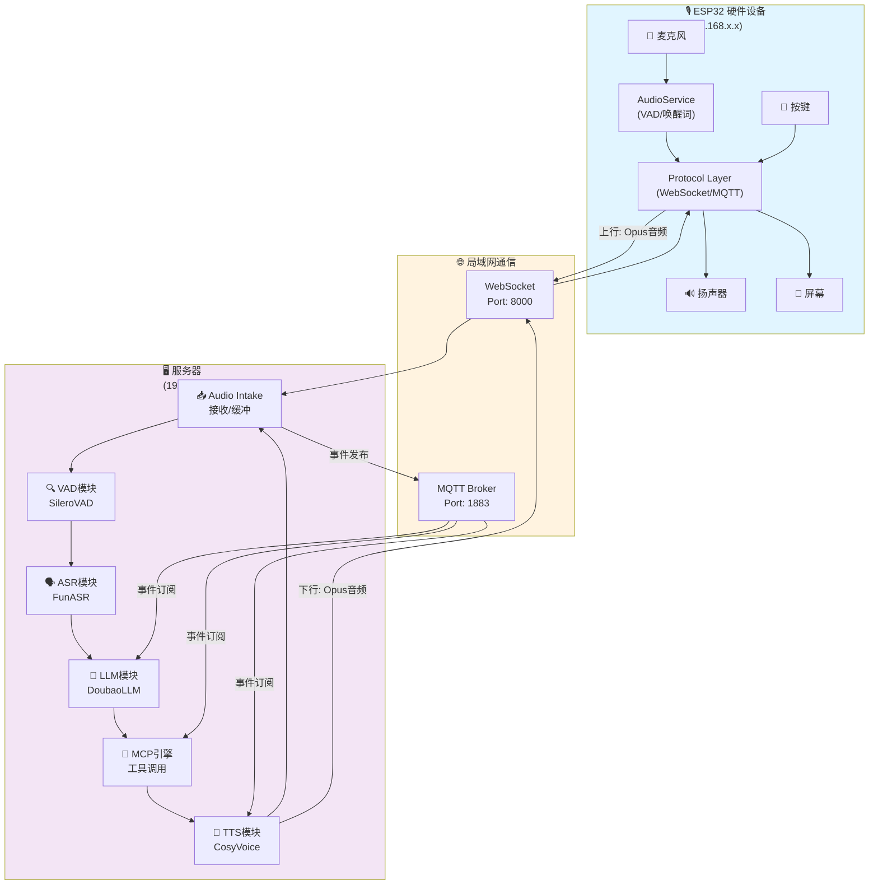
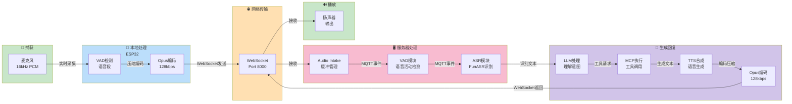
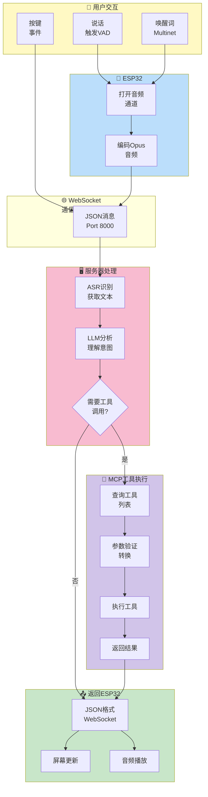
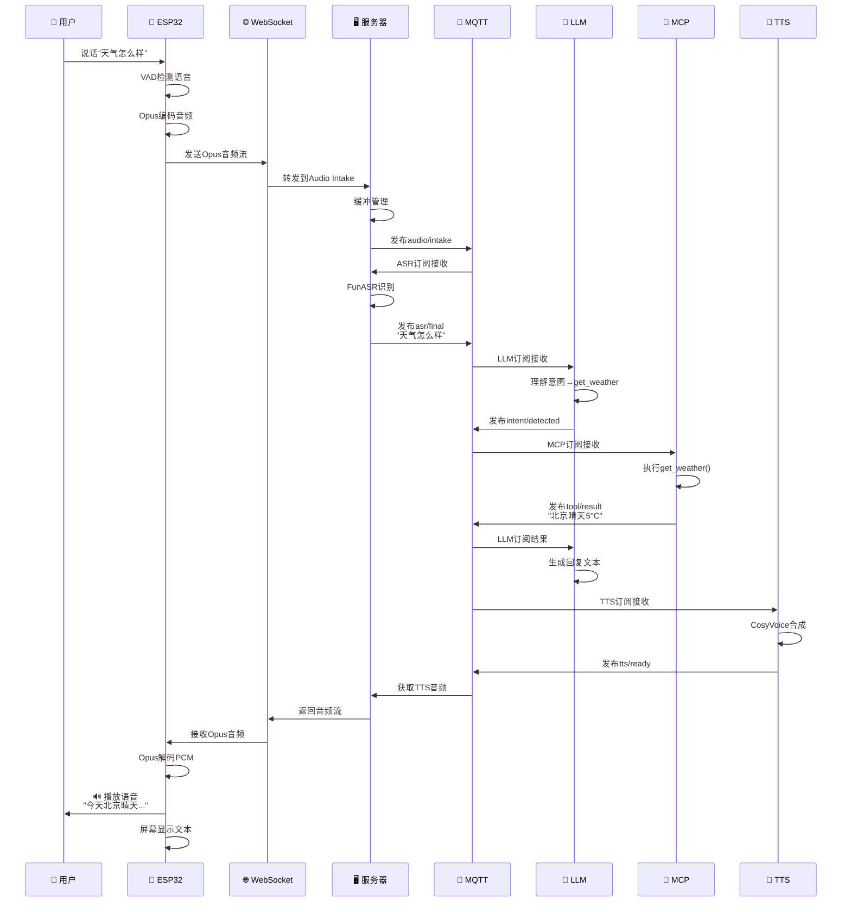
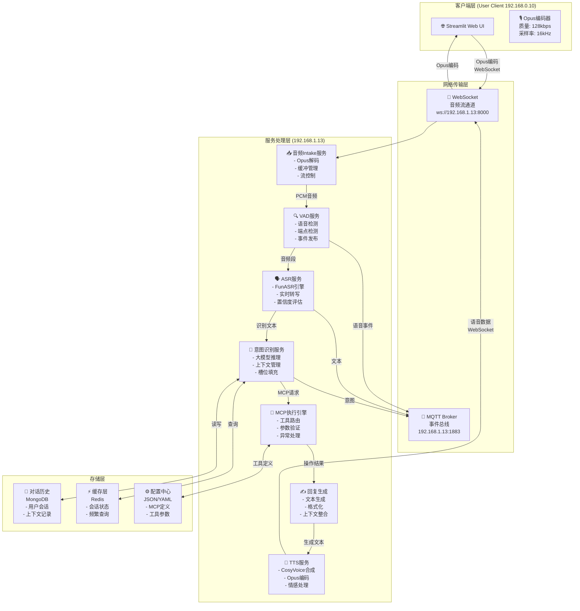

# xiaozhi-esp32-server & MR-MCP-Server 完整系统设计说明

**创建日期**: 2026年1月17日  
**版本**: 1.0  
**目标**: 构建一个集成语音交互、意图识别、MCP工具调用的完整本地智能系统

---

## 📋 文档概览

本文档分为两大部分：
1. **第一部分** - xiaozhi-esp32-server 现有系统分析
2. **第二部分** - MR-MCP-Server 新系统的完整设计方案

---

# 第一部分：xiaozhi-esp32-server 系统分析

## 1.1 系统概述

`xiaozhi-esp32-server` 是为 ESP32 硬件设备 (`xiaozhi-esp32`) 提供的后端服务系统。ESP32 端是一个基于硬件的语音助手，而服务器端提供云端的 AI 能力。两端通过 **MQTT 或 WebSocket** 协议进行通信。

### 系统特点
- 🎙️ **完全本地化** - 所有通信基于局域网（MQTT/WebSocket）
- 🧠 **云端智能** - 离线模型 + 在线大模型双引擎
- 🔧 **MCP 工具支持** - 灵活的工具调用框架
- 🎵 **高质量音频** - 支持 Opus 编码、本地 VAD/ASR
- 📱 **多设备支持** - 可同时连接多个 ESP32 设备

## 1.2 硬件端架构 (ESP32)

ESP32 硬件端的核心流程：

```
麦克风输入
    ↓
AudioService (音频采集、编码、VAD、唤醒词检测)
    ↓
本地识别 (Multinet v7 离线命令识别)
    ├─ 检测到唤醒词 → 打开音频通道
    ├─ 检测到退出命令 → 停止监听
    └─ 不匹配 → 继续等待
    ↓
Protocol (MQTT/WebSocket)
    ↓
服务器端处理
    ↓
返回结果 (STT/TTS/Tool)
    ↓
播放扬声器
    ↓
更新屏幕显示
```

**硬件端主要能力：**
- ✅ 本地音频采集和编码（Opus）
- ✅ 本地VAD语音活动检测
- ✅ 本地唤醒词识别（Multinet v7）
- ✅ 本地简单命令执行（如 "ok exit"）
- ✅ 与服务器通信获取 AI 处理结果

## 1.3 系统框图与数据流

### 1.3.1 网络拓扑结构 (Network Topology)



### 1.3.2 音频数据流 (Speech Path)



### 1.3.3 控制数据流 (Control Path)



### 1.3.4 MQTT事件总线 (Internal Message Bus)

```mermaid
graph TB
    subgraph MQTT["🚌 MQTT Broker<br/>Port 1883<br/>事件总线"]
        subgraph Audio["Audio主题"]
            A1["xiaozhi/audio/intake"]
            A2["xiaozhi/audio/vad/start"]
            A3["xiaozhi/audio/vad/end"]
        end
        
        subgraph ASRTopic["ASR主题"]
            B1["xiaozhi/asr/interim"]
            B2["xiaozhi/asr/final"]
        end
        
        subgraph Intent["Intent主题"]
            C1["xiaozhi/intent/detected"]
            C2["xiaozhi/intent/confidence"]
        end
        
        subgraph MCPTopic["MCP主题"]
            D1["xiaozhi/mcp/tool/list"]
            D2["xiaozhi/mcp/tool/call"]
            D3["xiaozhi/mcp/tool/result"]
        end
        
        subgraph TTSTopic["TTS主题"]
            E1["xiaozhi/tts/generated"]
            E2["xiaozhi/tts/ready"]
        end
    end
    
    subgraph Publishers["📤 发布者"]
        P1["Audio Intake"]
        P2["VAD模块"]
        P3["ASR模块"]
        P4["LLM模块"]
        P5["MCP模块"]
        P6["TTS模块"]
    end
    
    subgraph Subscribers["📥 订阅者"]
        S1["ASR订阅<br/>Audio事件"]
        S2["LLM订阅<br/>ASR结果"]
        S3["MCP订阅<br/>意图"]
        S4["TTS订阅<br/>意图"]
        S5["日志系统<br/>订阅全部"]
    end
    
    P1 --> A1
    P2 --> A2
    P2 --> A3
    P3 --> B1
    P3 --> B2
    P4 --> C1
    P4 --> C2
    P5 --> D1
    P5 --> D2
    P5 --> D3
    P6 --> E1
    P6 --> E2
    
    A1 --> S1
    B2 --> S2
    C1 --> S3
    C1 --> S4
    A1 --> S5
    B1 --> S5
    B2 --> S5
    C1 --> S5
    D1 --> S5
    D2 --> S5
    D3 --> S5
    E1 --> S5
    E2 --> S5
    
    style MQTT fill:#fff3e0
    style Publishers fill:#c8e6c9
    style Subscribers fill:#f8bbd0
```



### 1.3.5 完整的对话交互时序图



## 1.4 服务器端架构 (xiaozhi-esp32-server)

服务器端是 Python 实现的微服务系统，负责接收来自 ESP32 的音频，进行处理，并返回结果。

### 核心服务流程

```
ESP32 设备 (WebSocket/MQTT)
    ↓
WebSocket/MQTT 服务器 (Port: 8000)
    │
    ├─ Audio Intake 服务
    │   ├─ 接收 Opus 编码音频
    │   └─ 缓冲管理
    │
    ├─ VAD 服务 (语音活动检测)
    │   ├─ 检测语音开始/结束
    │   └─ 事件发布到 MQTT
    │
    ├─ ASR 服务 (语音识别)
    │   ├─ FunASR 引擎
    │   └─ 实时转写
    │
    ├─ LLM 服务 (意图识别)
    │   ├─ DoubaoLLM 或其他
    │   └─ 上下文管理
    │
    ├─ MCP 服务 (工具调用)
    │   ├─ 工具定义加载
    │   └─ 工具执行和返回
    │
    └─ TTS 服务 (文本转语音)
        ├─ 文本合成
        └─ Opus 编码返回
        
    ↓
返回到 ESP32 (音频/文本/指令)
```

### 通信协议

**ESP32 → 服务器：**
- 原始 Opus 编码音频流
- 音频帧元数据（采样率、通道数等）

**服务器 → ESP32：**
```json
{
    "type": "stt",          // 语音转文本结果
    "text": "你好",
    "is_final": true
}
```

```json
{
    "type": "tts",          // TTS 音频返回
    "data": "base64_encoded_opus_data"
}
```

```json
{
    "type": "tool",         // MCP 工具调用结果
    "tool_name": "get_weather",
    "result": "北京今天晴天，温度 5°C"
}
```

```json
{
    "type": "system",       // 系统命令
    "command": "reboot"
}
```

## 1.4 服务器端核心组件详解

### 1. WebSocket/MQTT 服务器

```yaml
服务: audio_intake (FastAPI + WebSocket)
地址: ws://192.168.1.13:8000/xiaozhi/v1/
功能:
  - 接收来自多个 ESP32 设备的音频流
  - 缓冲管理和流控制
  - 将音频分发到 VAD/ASR 处理管道
```

### 2. VAD 服务 (语音活动检测)

```yaml
服务: VAD (Voice Activity Detection)
模型: SileroVAD (本地离线)
功能:
  - 检测音频中是否包含语音
  - 检测语音开始和结束点
  - 发布 MQTT 事件: mr-mcp/audio/vad/start, mr-mcp/audio/vad/end
```

### 3. ASR 服务 (语音识别)

```yaml
服务: ASR (Automatic Speech Recognition)
模型: FunASR (本地离线)
功能:
  - 将音频转换为文本
  - 支持实时转写（流式识别）
  - 返回识别结果到 WebSocket 客户端
  版本: FunASR 1.2.7
```

### 4. LLM 服务 (大语言模型)

```yaml
服务: LLM (大模型)
支持: DoubaoLLM, OpenAI GPT, 本地 Ollama 等
功能:
  - 理解用户意图
  - 生成回复文本
  - 调用 MCP 工具
  - 上下文管理（多轮对话）
```

### 5. MCP 工具服务

```yaml
服务: MCP (Model Context Protocol)
功能:
  - 工具定义和注册
  - 从 LLM 接收工具调用请求
  - 执行本地工具或调用外部 API
  - 返回执行结果
示例工具:
  - 获取天气 (get_weather)
  - 播放音乐 (play_music)
  - 控制家电 (smart_home_control)
  - 获取新闻 (get_news)
```

### 6. TTS 服务 (文本转语音)

```yaml
服务: TTS (Text-To-Speech)
引擎: CosyVoice 或其他
功能:
  - 将文本转换为语音
  - Opus 编码输出
  - 支持多种音色和语言
  - 返回音频到 ESP32
```

## 1.5 事件驱动架构 (MQTT)

服务器内部使用 **MQTT** 作为事件总线，各服务通过发布/订阅进行通信：

```
主题结构: xiaozhi/<device_id>/<module>/<event>

例如:
xiaozhi/device_001/audio/vad/start      - VAD 检测到语音开始
xiaozhi/device_001/audio/vad/end        - VAD 检测到语音结束
xiaozhi/device_001/asr/interim          - ASR 中间识别结果
xiaozhi/device_001/asr/final            - ASR 最终识别结果
xiaozhi/device_001/intent/detected      - 意图识别完成
xiaozhi/device_001/mcp/tool_call        - MCP 工具调用请求
xiaozhi/device_001/tts/ready            - TTS 音频生成完成
```

## 1.6 项目文件结构

```
xiaozhi-esp32-server/
├── main/
│   ├── xiaozhi-server/          # Python 服务器实现
│   │   ├── app.py               # 主应用入口
│   │   ├── requirements.txt     # 依赖
│   │   ├── config.yaml          # 配置文件
│   │   ├── core/
│   │   │   ├── providers/       # 服务提供者
│   │   │   │   ├── asr/        # ASR (FunASR)
│   │   │   │   ├── vad/        # VAD (SileroVAD)
│   │   │   │   ├── tts/        # TTS
│   │   │   │   ├── llm/        # LLM (DoubaoLLM/OpenAI)
│   │   │   │   └── mcp/        # MCP 工具服务
│   │   │   ├── utils/          # 工具函数
│   │   │   └── handlers/       # 消息处理
│   │   └── websocket_server.py  # WebSocket 服务
│   │
│   └── esp/
│       └── xiaozhi-esp32/       # ESP32 固件代码
│           ├── main/           # 应用逻辑
│           │   ├── application.cc   # 主状态机
│           │   ├── protocol/        # MQTT/WebSocket 协议
│           │   ├── audio_service.cc # 音频采集
│           │   └── mcp_server.cc    # MCP 工具服务
│           ├── components/      # 硬件驱动
│           └── boards/         # 板卡支持
│
├── docker-compose.yml           # 容器编排
├── Dockerfile-server            # 服务器镜像
└── docs/
    ├── Deployment.md            # 部署指南
    └── mcp-endpoint-integration.md
```

## 1.7 部署方式

### 部署方式 1：Docker 容器

```bash
# 一键启动服务器
docker compose up -d

# 验证服务
curl http://localhost:8003/xiaozhi/ota/
```

**服务地址：**
- WebSocket: `ws://192.168.1.13:8000/xiaozhi/v1/`
- HTTP (OTA/Vision): `http://192.168.1.13:8003/xiaozhi/ota/`

### 部署方式 2：本地源码运行

```bash
# 创建 conda 环境
conda create -n xiaozhi-esp32-server python=3.10 -y
conda activate xiaozhi-esp32-server
conda install libopus ffmpeg -y

# 安装依赖
cd main/xiaozhi-server
pip install -r requirements.txt

# 配置文件
# 编辑 data/.config.yaml (或 config.yaml)

# 运行服务器
python app.py
```

## 1.8 关键配置说明

### config.yaml 核心配置项

```yaml
# LLM 配置（必须配置 API Key）
llm:
  provider: doubao        # 支持: doubao, openai, ollama, local
  api_key: "your-api-key"
  model: "gpt-4"

# ASR 配置
asr:
  provider: funasr       # FunASR 离线识别
  model_path: models/SenseVoiceSmall/model.pt
  
# VAD 配置
vad:
  provider: silero       # SileroVAD 离线检测
  
# TTS 配置
tts:
  provider: cosyvoice    # CosyVoice 或其他
  
# WebSocket 配置
websocket:
  host: 0.0.0.0
  port: 8000
  path: /xiaozhi/v1/
```

## 1.9 典型对话流程

```
ESP32 用户说话:
  "天气怎么样"
    ↓
[ESP32] 本地 VAD 检测到语音 → 打开音频通道
    ↓
[ESP32] 本地 Multinet 检测到唤醒词 "小智"
    ↓
[ESP32] 发送音频到服务器 (WebSocket/MQTT)
    ↓
[服务器] Audio Intake 接收音频
    ↓
[服务器] VAD 检测语音段落
    ↓
[服务器] ASR (FunASR) 识别: "天气怎么样"
    ↓
[服务器] LLM (DoubaoLLM) 理解意图 → 调用 MCP 工具
    ↓
[服务器] MCP 工具执行: get_weather()
    ↓
[服务器] 获取结果: "北京今天晴天 5°C"
    ↓
[服务器] LLM 生成自然语言回复
    ↓
[服务器] TTS (CosyVoice) 生成语音
    ↓
[服务器] 返回语音到 ESP32 (WebSocket/MQTT)
    ↓
[ESP32] 播放语音到扬声器
    ↓
对话完成，回到待机状态
```

---

# 第二部分：MR-MCP-Server 详细设计

## 2.1 设计目标与原则

### 设计目标
1. ✅ **远程音频输入** - Streamlit Web UI 通过 Opus 编码传输音频
2. ✅ **内部通信** - 基于 Socket/MQTT 架构的服务间通信
3. ✅ **实时处理** - 多线程并发处理语音流
4. ✅ **MCP工具集成** - 灵活的工具调用框架
5. ✅ **本地部署** - 完全基于局域网，无互联网依赖
6. ✅ **状态管理** - 分布式状态同步

### 设计原则
- **模块化** - 各服务独立部署和扩展
- **事件驱动** - 基于MQTT的松耦合架构
- **高可用** - 自动恢复和重试机制
- **易扩展** - 工具框架简化添加新功能
- **可观测** - 完整的日志和监控

## 2.2 系统级架构框图




## 2.3 Opus 音频编码规范

### 编码参数

```yaml
opus_config:
  采样率: 16kHz           # 语音优化频率
  比特率: 128kbps        # 平衡质量和带宽
  声道: 1               # 单声道 (Mono)
  帧时长: 60ms          # 960样本 @ 16kHz
  复杂度: 10            # 最高质量
  VBR: true            # 可变比特率
  bandwidth: wideband  # 16kHz带宽

性能指标:
  编码延迟: < 10ms
  传输延迟: < 50ms
  总往返延迟: < 100ms
  
网络优势:
  2分钟音频数据: ≈ 1.92 MB
  1小时连续音频: ≈ 57.6 MB
  实时带宽消耗: ≈ 128 kbps
```

## 2.4 通信协议设计

### WebSocket 音频帧格式

**客户端 → 服务器 (音频上传)**:
```json
{
    "type": "audio",
    "frame_type": "audio",
    "session_id": "uuid-string",
    "timestamp": 1705420225.123,
    "sequence": 1234,
    "codec": "opus",
    "sample_rate": 16000,
    "channels": 1,
    "data": "base64_encoded_opus_data"
}
```

**服务器 → 客户端 (实时字幕)**:
```json
{
    "type": "transcript",
    "session_id": "uuid-string",
    "timestamp": 1705420225.234,
    "text": "你好，这是识别结果",
    "is_final": false,
    "confidence": 0.92
}
```

### MQTT 事件总线设计

**主题结构** (前缀: `mr-mcp/`):

```
mr-mcp/
├── audio/
│   ├── intake/chunk       # 音频chunk事件
│   ├── vad/start          # VAD语音开始
│   └── vad/end            # VAD语音结束
├── asr/
│   ├── interim            # ASR中间识别结果
│   └── final              # ASR最终识别结果
├── intent/
│   ├── detected           # 意图检测完成
│   └── error              # 意图识别错误
├── mcp/
│   ├── tool/call          # MCP工具调用请求
│   ├── tool/result        # MCP工具执行结果
│   └── tool/error         # MCP工具执行错误
└── tts/
    └── ready              # TTS合成完成
```

## 2.5 项目代码结构规划

```
mr-mcp-server/
├── README.md
├── 设计说明.md (本文档)
│
├── client/                          # Streamlit客户端
│   ├── app.py                      # 主应用
│   ├── audio_manager.py            # 音频采集+Opus编码
│   ├── websocket_client.py         # WebSocket客户端
│   ├── ui_components.py            # UI组件
│   ├── session_state.py            # 会话管理
│   ├── config.yaml
│   └── requirements.txt
│
├── services/                        # 微服务实现
│   ├── audio_intake/
│   │   ├── server.py               # WebSocket服务器
│   │   ├── opus_decoder.py         # Opus解码器
│   │   ├── buffer_manager.py       # 缓冲管理
│   │   └── config.py
│   │
│   ├── vad/
│   │   ├── service.py              # VAD主服务
│   │   ├── detector.py             # VAD检测器
│   │   └── config.py
│   │
│   ├── asr/
│   │   ├── service.py              # ASR主服务
│   │   ├── recognizer.py           # 识别器
│   │   └── config.py
│   │
│   ├── intent/
│   │   ├── service.py              # 主服务
│   │   ├── context_manager.py      # 上下文管理
│   │   ├── llm_client.py           # LLM调用
│   │   └── config.py
│   │
│   ├── mcp/
│   │   ├── service.py              # 主服务
│   │   ├── engine.py               # 执行引擎
│   │   ├── tool_loader.py          # 工具加载
│   │   ├── tools/                  # 工具实现
│   │   │   ├── base.py             # 基类
│   │   │   ├── reminder.py         # 提醒工具
│   │   │   └── messaging.py        # 消息工具
│   │   └── config.py
│   │
│   └── tts/
│       ├── service.py              # TTS主服务
│       ├── synthesizer.py          # 合成器
│       └── config.py
│
├── shared/                          # 共享模块
│   ├── mqtt_bus.py                 # MQTT事件总线
│   ├── models.py                   # 数据模型
│   ├── constants.py                # 常量定义
│   └── logger.py                   # 日志配置
│
├── config/                          # 配置文件
│   ├── config.yaml                 # 主配置
│   ├── tools_definition.json       # MCP工具定义
│   └── prompts.yaml                # LLM Prompts
│
├── docker/
│   └── docker-compose.yml          # 服务编排
│
└── tests/                           # 测试
    ├── test_audio.py
    ├── test_websocket.py
    └── test_mqtt.py
```

## 2.6 实现路线图 (10周)

### Phase 1: 基础框架 (第1-2周)
**目标**: 建立项目基础架构和通信机制

- [x] 项目初始化和目录结构
- [ ] WebSocket服务器实现 + Opus编解码库集成
- [ ] MQTT Broker部署和事件总线实现
- [ ] 基本的Streamlit客户端框架
- [ ] Docker Compose基础配置
- [ ] **验证**: 音频实时传输成功

### Phase 2: 核心音频服务 (第3-4周)
**目标**: 实现音频采集、处理、识别的完整链路

- [ ] Audio Intake服务（Opus解码、缓冲）
- [ ] VAD服务集成（实时语音检测）
- [ ] ASR服务集成（FunASR引擎）
- [ ] 实时字幕推送到客户端
- [ ] MQTT事件流联调
- [ ] **验证**: 音频识别全流程可用

### Phase 3: 智能处理层 (第5-6周)
**目标**: 实现意图识别和对话管理

- [ ] 意图识别服务（大模型推理）
- [ ] 对话历史管理（MongoDB）
- [ ] 多轮对话上下文支持
- [ ] Redis缓存层集成
- [ ] Prompt优化和测试
- [ ] **验证**: 意图识别准确率>85%

### Phase 4: MCP工具集成 (第7-8周)
**目标**: 实现MCP执行引擎和工具管理

- [ ] MCP执行引擎核心实现
- [ ] 工具动态加载框架
- [ ] 参数验证和转换
- [ ] 异常处理和重试逻辑
- [ ] 3-5个示例工具实现
- [ ] **验证**: 工具调用成功率>95%

### Phase 5: 优化和完善 (第9-10周)
**目标**: 性能优化、文档、部署

- [ ] 系统性能优化（缓冲区调优、模型加速）
- [ ] 错误恢复机制完善
- [ ] 系统监控和日志配置
- [ ] 完整的开发和部署文档
- [ ] 集成测试和压力测试
- [ ] **验证**: 系统可靠运行>99%

## 2.7 关键技术要点

### Opus编码关键参数

```python
import opuslib

# 客户端编码器配置
encoder = opuslib.Encoder(
    16000,                      # 采样率 16kHz
    1,                          # 单声道
    opuslib.APPLICATION_VOIP    # VoIP应用
)
encoder.bitrate = 128000        # 128 kbps
encoder.bandwidth = opuslib.BANDWIDTH_WIDEBAND
encoder.complexity = 10         # 最高质量
encoder.use_vbr = True         # 可变比特率
encoder.vbr_constraint = False

# 服务端解码器配置
decoder = opuslib.Decoder(16000, 1)
```

### MQTT事件驱动框架

```python
from shared.mqtt_bus import get_mqtt_bus, init_mqtt_bus

# 初始化MQTT总线
mqtt_bus = init_mqtt_bus()

# 订阅事件
async def handle_vad_start(payload):
    print(f"VAD detected speech start: {payload}")

mqtt_bus.subscribe("mr-mcp/audio/vad/start", handle_vad_start)

# 发布事件
mqtt_bus.publish("mr-mcp/audio/vad/start", {
    "session_id": "uuid",
    "timestamp": 1705420225.123,
    "audio_level": 0.65
})
```

---

## 文档信息

**作者**: Jiheng Zhang  
**邮箱**: jiheng.zhang@gehealthcare.com  
**SSO ID**: 212597558  
**版权**: © 2026 GE Healthcare. All rights reserved.  
**最后修改**: 2026-01-17

---

---

# 第三部分：快速入门指南

## 3.1 30秒快速开始

```bash
# 1. 激活环境
conda activate audio_env

# 2. 进入项目
cd /home/tester/AI_Tools/mr-mcp-server

# 3. 初始化项目
bash setup.sh

# 4. 启动服务（新终端）
bash scripts/start_audio_intake.sh &
bash scripts/start_streamlit.sh

# 5. 打开浏览器
# http://localhost:8501
```

## 3.2 Conda环境配置

### 查看所有 Conda 环境

```bash
# 查看所有 conda 环境
conda env list

# 预期输出：
# base                  /home/tester/miniconda3
# audio_env          *  /home/tester/miniconda3/envs/audio_env
```

### 激活环境

**方式1：直接激活（推荐）**

```bash
# 激活 audio_env 环境
conda activate audio_env

# 验证激活（提示符会显示 (audio_env)）
# (audio_env) $ 
```

**方式2：在脚本中激活**

```bash
#!/bin/bash
eval "$(conda shell.bash hook)"
conda activate audio_env

# 后续命令自动在 audio_env 中运行
python --version
```

### 环境信息

```bash
# 激活环境
conda activate audio_env

# 查看 Python 版本
python --version

# 查看 pip 版本
pip --version

# 查看所有已安装的包
pip list

# 查看环境路径
python -c "import sys; print(sys.prefix)"
```

### 预期输出

```
(audio_env) $ python --version
Python 3.10.x

(audio_env) $ pip --version
pip x.x.x from /home/tester/miniconda3/envs/audio_env/lib/python3.10/site-packages/pip ...

(audio_env) $ python -c "import sys; print(sys.prefix)"
/home/tester/miniconda3/envs/audio_env
```

### 包管理

**查看已安装包**

```bash
# 激活环境
conda activate audio_env

# 显示所有包
pip list

# 显示特定包的版本
pip show fastapi
pip show uvicorn
```

**安装新包**

```bash
# 激活环境
conda activate audio_env

# 通过 conda 安装
conda install package_name

# 通过 pip 安装
pip install package_name

# 安装指定版本
pip install package_name==1.0.0
```

**更新包**

```bash
# 激活环境
conda activate audio_env

# 更新 pip
pip install --upgrade pip

# 更新特定包
pip install --upgrade package_name

# 从 requirements.txt 更新所有包
pip install -r requirements.txt --upgrade
```

---

# 第四部分：Streamlit客户端文档

## 4.1 客户端概述

该客户端提供一个易于使用的 Web 界面，支持：
- 🎤 实时音频采集（通过麦克风）
- 🔊 Opus 高效编码（128kbps，16kHz）
- 💬 WebSocket 实时传输到服务器
- 📊 实时音量监控
- 💭 对话历史显示
- 🔌 自动连接管理

## 4.2 安装和启动

### 安装依赖

```bash
# 安装 Python 依赖
pip install -r client/requirements.txt

# 或使用 conda
conda install --file client/requirements.txt
```

**注意**: 某些依赖（pyaudio, opuslib）可能需要系统库支持：

```bash
# Ubuntu/Debian
sudo apt-get install python3-dev portaudio19-dev libopus-dev

# macOS
brew install portaudio opus

# Windows
# 使用预编译的 wheels（pip 会自动下载）
```

### 启动服务器

确保 WebSocket 服务器已启动：

```bash
# 终端 1: 启动 MQTT broker
sudo systemctl start mosquitto

# 终端 2: 启动 WebSocket 音频服务器
./scripts/start_audio_intake.sh

# 输出应显示:
# INFO     - Server started: ws://0.0.0.0:8000/ws/audio
```

### 启动 Streamlit 客户端

```bash
# 终端 3: 启动 Streamlit 应用
./scripts/start_streamlit.sh

# 或直接使用 streamlit 命令
streamlit run client/app.py
```

应用将在浏览器中打开，通常是 `http://localhost:8501`

## 4.3 使用指南

### 基本流程

1. **连接**: 点击 "🔌 连接" 按钮连接到 WebSocket 服务器
2. **录音**: 点击 "🎤 开始录音" 开始采集音频
3. **说话**: 对着麦克风说话
4. **停止**: 点击 "⏹ 停止录音" 结束本轮交互
5. **查看结果**: 在对话框中查看转录和响应

### 界面组件

#### 控制面板
- **🔌 连接**: 连接/断开 WebSocket 服务器
- **🎤 开始录音**: 启动音频采集流
- **⏹ 停止录音**: 结束音频传输

#### 实时监控（右侧边栏）
- **连接状态**: 显示服务器连接状态
- **录音状态**: 显示当前是否在录音
- **音量水平**: 实时音频级别指示
- **统计信息**: 
  - 已发送帧数
  - 已接收帧数
  - 连接时长
  - 会话 ID

#### 对话区域（左侧主区域）
- **💬 对话**: 显示完整的对话历史
- **📝 实时转录**: 显示实时转录文本
- **📊 对话**: 显示用户消息和助手响应

### 设置面板

点击左侧边栏的 "⚙️ 设置" 展开高级选项：

- **Server URI**: WebSocket 服务器地址
  - 默认: `ws://localhost:8000/ws/audio`
  - 示例: `ws://192.168.1.100:8000/ws/audio`
- **Auto Reconnect**: 连接断开时自动重新连接
- **Debug Mode**: 启用调试日志输出

## 4.4 配置

### 环境变量

```bash
# WebSocket 服务器地址
export WEBSOCKET_SERVER=ws://localhost:8000/ws/audio

# 调试模式
export DEBUG_MODE=true

# 启动客户端
./scripts/start_streamlit.sh
```

### 音频参数 (client/config.py)

```python
sample_rate: int = 16000        # 采样率 (Hz)
chunk_duration_ms: int = 60     # 每个块的持续时间 (ms)
bitrate: int = 128000           # Opus 比特率 (bps)
```

修改这些值需要重启应用。

## 4.5 WebSocket 通讯协议

### 客户端 → 服务器

#### 启动流 (START Frame)
```json
{
  "type": "audio",
  "frame_type": "start",
  "session_id": "uuid-string",
  "timestamp": 1705420225.123
}
```

#### 音频帧 (AUDIO Frame)
```json
{
  "type": "audio",
  "frame_type": "audio",
  "session_id": "uuid-string",
  "timestamp": 1705420225.123,
  "sequence": 1,
  "codec": "opus",
  "sample_rate": 16000,
  "channels": 1,
  "data": "hex_encoded_opus_bytes"
}
```

#### 结束流 (END Frame)
```json
{
  "type": "audio",
  "frame_type": "end",
  "session_id": "uuid-string",
  "timestamp": 1705420225.123
}
```

### 服务器 → 客户端

#### 状态消息
```json
{
  "type": "status",
  "session_id": "uuid-string",
  "message": "Audio received",
  "frames_received": 10
}
```

#### 转录结果
```json
{
  "type": "transcript",
  "session_id": "uuid-string",
  "text": "你好",
  "is_final": false,
  "confidence": 0.95
}
```

#### 最终结果
```json
{
  "type": "result",
  "session_id": "uuid-string",
  "text": "识别完成的文本",
  "is_final": true
}
```

---

# 第五部分：Docker部署指南

## 5.1 快速开始

### 前置要求

- Docker 20.10+
- Docker Compose 2.0+
- 4GB+ 内存
- 100MB 磁盘空间

### 一键启动

```bash
# 进入项目目录
cd /home/tester/AI_Tools/mr-mcp-server

# 一键启动所有服务
./docker-up.sh

# 或使用 docker-compose 命令
docker-compose up -d
```

### 访问服务

- **Streamlit 客户端**: http://localhost:8501
- **WebSocket 服务器**: ws://localhost:8000/ws/audio
- **MQTT Broker**: mqtt://localhost:1883

### 查看日志

```bash
# 查看所有服务日志
docker-compose logs -f

# 查看特定服务日志
docker-compose logs -f audio-server
docker-compose logs -f streamlit-client
docker-compose logs -f mqtt
```

### 停止服务

```bash
# 停止但保留容器
docker-compose stop

# 停止并删除容器
./docker-down.sh

# 或使用 docker-compose
docker-compose down
```

## 5.2 Docker架构

```
┌─────────────────────────────────────────────────────────────┐
│                    Docker Compose                            │
├─────────────────────────────────────────────────────────────┤
│                                                               │
│  ┌────────────────┐  ┌────────────────┐  ┌────────────────┐ │
│  │  MQTT Broker   │  │ WebSocket      │  │  Streamlit     │ │
│  │                │  │ Server         │  │  Client        │ │
│  │ mosquitto:1883 │  │ :8000/ws/audio │  │  :8501         │ │
│  └────────────────┘  └────────────────┘  └────────────────┘ │
│         ↓                    ↓                    ↓           │
│  ┌────────────────┐  ┌────────────────┐  ┌────────────────┐ │
│  │ mosquitto_data │  │     logs       │  │     logs       │ │
│  │ mosquitto_logs │  └────────────────┘  └────────────────┘ │
│  └────────────────┘                                           │
│                                                               │
│            Network: mr-mcp-network (bridge)                 │
│                                                               │
└─────────────────────────────────────────────────────────────┘
```

## 5.3 Docker Compose 配置详解

### docker-compose.yml 文件结构

```yaml
services:
  mqtt:              # MQTT 消息代理
    image: eclipse-mosquitto:latest
    ports: ["1883:1883", "9001:9001"]
    
  audio-server:      # WebSocket 音频服务器
    build: Dockerfile.audio-server
    ports: ["8000:8000"]
    depends_on: [mqtt]
    
  streamlit-client:  # Streamlit 前端客户端
    build: Dockerfile.streamlit-client
    ports: ["8501:8501"]
    depends_on: [audio-server]

networks:
  mr-mcp-network:    # 自定义网络
    driver: bridge

volumes:
  mosquitto_data:    # MQTT 数据卷
  mosquitto_logs:    # MQTT 日志卷
```

### 环境变量

#### audio-server (WebSocket 服务器)

```bash
MQTT_HOST=mqtt                      # MQTT 主机名（容器网络内）
MQTT_PORT=1883                      # MQTT 端口
MQTT_USER=guest                     # MQTT 用户名
MQTT_PASSWORD=guest                 # MQTT 密码
LOG_LEVEL=INFO                      # 日志级别
WEBSOCKET_PORT=8000                 # WebSocket 端口
WEBSOCKET_HOST=0.0.0.0              # WebSocket 监听地址
```

#### streamlit-client (Streamlit 客户端)

```bash
WEBSOCKET_SERVER=ws://audio-server:8000/ws/audio  # WebSocket 服务器地址
DEBUG_MODE=false                    # 调试模式
STREAMLIT_SERVER_PORT=8501          # Streamlit 端口
STREAMLIT_SERVER_ADDRESS=0.0.0.0    # Streamlit 监听地址
```

## 5.4 管理脚本

### ./docker.sh - 完整管理工具

```bash
# 启动服务
./docker.sh up

# 停止服务
./docker.sh down

# 重启服务
./docker.sh restart

# 查看日志
./docker.sh logs        # 所有服务
./docker.sh logs-mqtt   # MQTT
./docker.sh logs-audio  # WebSocket 服务器
./docker.sh logs-client # Streamlit 客户端

# 查看状态
./docker.sh status

# 构建镜像
./docker.sh build
./docker.sh rebuild     # 不缓存重新构建

# 清理
./docker.sh clean

# 开启 Shell
./docker.sh shell-mqtt
./docker.sh shell-audio
./docker.sh shell-client

# 帮助
./docker.sh help
```

### ./docker-up.sh - 快速启动

一键启动，自动构建和启动所有服务。

### ./docker-down.sh - 快速停止

停止所有服务，可选删除卷。

## 5.5 常见操作

### 查看日志并实时跟踪

```bash
# 所有服务
docker-compose logs -f

# 特定服务
docker-compose logs -f audio-server
docker-compose logs -f streamlit-client

# 最后 100 行
docker-compose logs --tail=100

# 特定时间范围
docker-compose logs --since 10m
```

### 进入容器 Shell

```bash
# WebSocket 服务器
docker exec -it mr-mcp-server-audio-server-1 /bin/bash

# Streamlit 客户端
docker exec -it mr-mcp-server-streamlit-client-1 /bin/bash

# MQTT Broker
docker exec -it mr-mcp-server-mqtt-1 /bin/sh
```

### 重启特定服务

```bash
# 重启音频服务器
docker-compose restart audio-server

# 重启 Streamlit
docker-compose restart streamlit-client
```

---

## 总结与建议

### 系统特点总结

✅ **完全本地化** - 所有通信基于局域网  
✅ **模块化架构** - 各服务独立部署和扩展  
✅ **事件驱动设计** - MQTT事件总线解耦服务  
✅ **多轮对话支持** - 完整的上下文管理  
✅ **灵活的工具框架** - 易于添加新工具  
✅ **高质量音频** - Opus编码保证传输效率  

### 后续推荐步骤

1. **确认设计** - 根据此文档确认系统需求是否完整
2. **细化接口** - 在实施前细化各模块的API定义
3. **原型开发** - Phase 1-2实现基础框架，验证可行性
4. **迭代优化** - 根据实际运行情况优化参数和性能
5. **文档完善** - 持续更新开发和部署文档

---

**文档完成日期**: 2026年1月17日  
**版本**: 1.0  
**下一步**: 开始Phase 1实现
