# xiaozhi-esp32-server & MR-MCP-Server 完整系统设计说明

**创建日期**: 2026年1月17日  
**版本**: 1.0  
**目标**: 构建一个集成语音交互、意图识别、MCP工具调用的完整本地智能系统

---

## 📋 文档概览

本文档分为两大部分：
1. **第一部分** - xiaozhi-esp32-server 现有系统分析
2. **第二部分** - MR-MCP-Server 新系统的完整设计方案

---

# 第一部分：xiaozhi-esp32-server 系统分析

## 1.1 系统概述

`xiaozhi-esp32-server` 是为 ESP32 硬件设备 (`xiaozhi-esp32`) 提供的后端服务系统。ESP32 端是一个基于硬件的语音助手，而服务器端提供云端的 AI 能力。两端通过 **MQTT 或 WebSocket** 协议进行通信。

### 系统特点
- 🎙️ **完全本地化** - 所有通信基于局域网（MQTT/WebSocket）
- 🧠 **云端智能** - 离线模型 + 在线大模型双引擎
- 🔧 **MCP 工具支持** - 灵活的工具调用框架
- 🎵 **高质量音频** - 支持 Opus 编码、本地 VAD/ASR
- 📱 **多设备支持** - 可同时连接多个 ESP32 设备

## 1.2 硬件端架构 (ESP32)

ESP32 硬件端的核心流程：

```
麦克风输入
    ↓
AudioService (音频采集、编码、VAD、唤醒词检测)
    ↓
本地识别 (Multinet v7 离线命令识别)
    ├─ 检测到唤醒词 → 打开音频通道
    ├─ 检测到退出命令 → 停止监听
    └─ 不匹配 → 继续等待
    ↓
Protocol (MQTT/WebSocket)
    ↓
服务器端处理
    ↓
返回结果 (STT/TTS/Tool)
    ↓
播放扬声器
    ↓
更新屏幕显示
```

**硬件端主要能力：**
- ✅ 本地音频采集和编码（Opus）
- ✅ 本地VAD语音活动检测
- ✅ 本地唤醒词识别（Multinet v7）
- ✅ 本地简单命令执行（如 "ok exit"）
- ✅ 与服务器通信获取 AI 处理结果

## 1.3 系统框图与数据流

### 1.3.1 网络拓扑结构 (Network Topology)

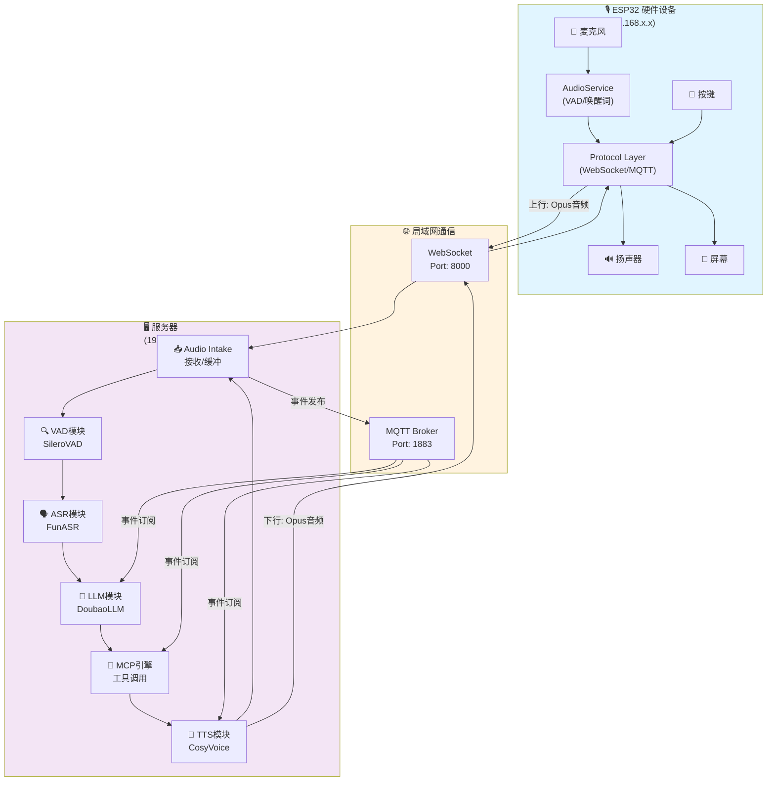

### 1.3.2 音频数据流 (Speech Path)

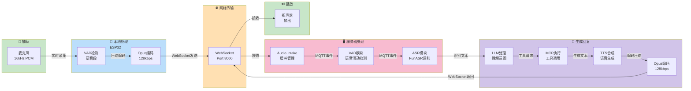

### 1.3.3 控制数据流 (Control Path)

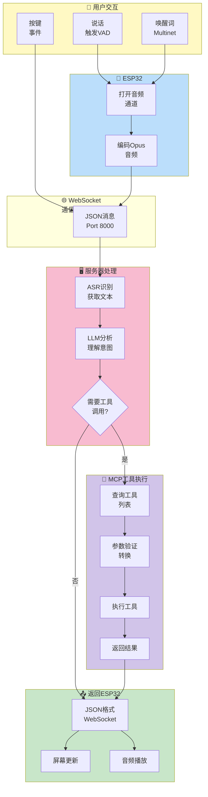

### 1.3.4 MQTT事件总线 (Internal Message Bus)

```mermaid
graph TB
    subgraph MQTT["🚌 MQTT Broker<br/>Port 1883<br/>事件总线"]
        subgraph Audio["Audio主题"]
            A1["xiaozhi/audio/intake"]
            A2["xiaozhi/audio/vad/start"]
            A3["xiaozhi/audio/vad/end"]
        end
        
        subgraph ASRTopic["ASR主题"]
            B1["xiaozhi/asr/interim"]
            B2["xiaozhi/asr/final"]
        end
        
        subgraph Intent["Intent主题"]
            C1["xiaozhi/intent/detected"]
            C2["xiaozhi/intent/confidence"]
        end
        
        subgraph MCPTopic["MCP主题"]
            D1["xiaozhi/mcp/tool/list"]
            D2["xiaozhi/mcp/tool/call"]
            D3["xiaozhi/mcp/tool/result"]
        end
        
        subgraph TTSTopic["TTS主题"]
            E1["xiaozhi/tts/generated"]
            E2["xiaozhi/tts/ready"]
        end
    end
    
    subgraph Publishers["📤 发布者"]
        P1["Audio Intake"]
        P2["VAD模块"]
        P3["ASR模块"]
        P4["LLM模块"]
        P5["MCP模块"]
        P6["TTS模块"]
    end
    
    subgraph Subscribers["📥 订阅者"]
        S1["ASR订阅<br/>Audio事件"]
        S2["LLM订阅<br/>ASR结果"]
        S3["MCP订阅<br/>意图"]
        S4["TTS订阅<br/>意图"]
        S5["日志系统<br/>订阅全部"]
    end
    
    P1 --> A1
    P2 --> A2
    P2 --> A3
    P3 --> B1
    P3 --> B2
    P4 --> C1
    P4 --> C2
    P5 --> D1
    P5 --> D2
    P5 --> D3
    P6 --> E1
    P6 --> E2
    
    A1 --> S1
    B2 --> S2
    C1 --> S3
    C1 --> S4
    A1 --> S5
    B1 --> S5
    B2 --> S5
    C1 --> S5
    D1 --> S5
    D2 --> S5
    D3 --> S5
    E1 --> S5
    E2 --> S5
    
    style MQTT fill:#fff3e0
    style Publishers fill:#c8e6c9
    style Subscribers fill:#f8bbd0
```

### 1.3.5 完整的对话交互时序图

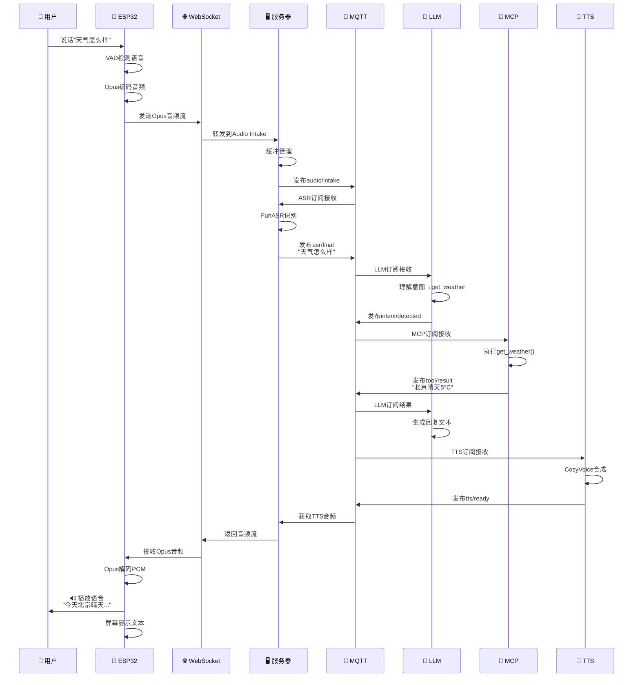

## 1.4 服务器端架构 (xiaozhi-esp32-server)

服务器端是 Python 实现的微服务系统，负责接收来自 ESP32 的音频，进行处理，并返回结果。

### 核心服务流程

```
ESP32 设备 (WebSocket/MQTT)
    ↓
WebSocket/MQTT 服务器 (Port: 8000)
    │
    ├─ Audio Intake 服务
    │   ├─ 接收 Opus 编码音频
    │   └─ 缓冲管理
    │
    ├─ VAD 服务 (语音活动检测)
    │   ├─ 检测语音开始/结束
    │   └─ 事件发布到 MQTT
    │
    ├─ ASR 服务 (语音识别)
    │   ├─ FunASR 引擎
    │   └─ 实时转写
    │
    ├─ LLM 服务 (意图识别)
    │   ├─ DoubaoLLM 或其他
    │   └─ 上下文管理
    │
    ├─ MCP 服务 (工具调用)
    │   ├─ 工具定义加载
    │   └─ 工具执行和返回
    │
    └─ TTS 服务 (文本转语音)
        ├─ 文本合成
        └─ Opus 编码返回
        
    ↓
返回到 ESP32 (音频/文本/指令)
```

### 通信协议

**ESP32 → 服务器：**
- 原始 Opus 编码音频流
- 音频帧元数据（采样率、通道数等）

**服务器 → ESP32：**
```json
{
    "type": "stt",          // 语音转文本结果
    "text": "你好",
    "is_final": true
}
```

```json
{
    "type": "tts",          // TTS 音频返回
    "data": "base64_encoded_opus_data"
}
```

```json
{
    "type": "tool",         // MCP 工具调用结果
    "tool_name": "get_weather",
    "result": "北京今天晴天，温度 5°C"
}
```

```json
{
    "type": "system",       // 系统命令
    "command": "reboot"
}
```

## 1.4 服务器端核心组件详解

### 1. WebSocket/MQTT 服务器

```yaml
服务: audio_intake (FastAPI + WebSocket)
地址: ws://192.168.1.13:8000/xiaozhi/v1/
功能:
  - 接收来自多个 ESP32 设备的音频流
  - 缓冲管理和流控制
  - 将音频分发到 VAD/ASR 处理管道
```

### 2. VAD 服务 (语音活动检测)

```yaml
服务: VAD (Voice Activity Detection)
模型: SileroVAD (本地离线)
功能:
  - 检测音频中是否包含语音
  - 检测语音开始和结束点
  - 发布 MQTT 事件: mr-mcp/audio/vad/start, mr-mcp/audio/vad/end
```

### 3. ASR 服务 (语音识别)

```yaml
服务: ASR (Automatic Speech Recognition)
模型: FunASR (本地离线)
功能:
  - 将音频转换为文本
  - 支持实时转写（流式识别）
  - 返回识别结果到 WebSocket 客户端
  版本: FunASR 1.2.7
```

### 4. LLM 服务 (大语言模型)

```yaml
服务: LLM (大模型)
支持: DoubaoLLM, OpenAI GPT, 本地 Ollama 等
功能:
  - 理解用户意图
  - 生成回复文本
  - 调用 MCP 工具
  - 上下文管理（多轮对话）
```

### 5. MCP 工具服务

```yaml
服务: MCP (Model Context Protocol)
功能:
  - 工具定义和注册
  - 从 LLM 接收工具调用请求
  - 执行本地工具或调用外部 API
  - 返回执行结果
示例工具:
  - 获取天气 (get_weather)
  - 播放音乐 (play_music)
  - 控制家电 (smart_home_control)
  - 获取新闻 (get_news)
```

### 6. TTS 服务 (文本转语音)

```yaml
服务: TTS (Text-To-Speech)
引擎: CosyVoice 或其他
功能:
  - 将文本转换为语音
  - Opus 编码输出
  - 支持多种音色和语言
  - 返回音频到 ESP32
```

## 1.5 事件驱动架构 (MQTT)

服务器内部使用 **MQTT** 作为事件总线，各服务通过发布/订阅进行通信：

```
主题结构: xiaozhi/<device_id>/<module>/<event>

例如:
xiaozhi/device_001/audio/vad/start      - VAD 检测到语音开始
xiaozhi/device_001/audio/vad/end        - VAD 检测到语音结束
xiaozhi/device_001/asr/interim          - ASR 中间识别结果
xiaozhi/device_001/asr/final            - ASR 最终识别结果
xiaozhi/device_001/intent/detected      - 意图识别完成
xiaozhi/device_001/mcp/tool_call        - MCP 工具调用请求
xiaozhi/device_001/tts/ready            - TTS 音频生成完成
```

## 1.6 项目文件结构

```
xiaozhi-esp32-server/
├── main/
│   ├── xiaozhi-server/          # Python 服务器实现
│   │   ├── app.py               # 主应用入口
│   │   ├── requirements.txt     # 依赖
│   │   ├── config.yaml          # 配置文件
│   │   ├── core/
│   │   │   ├── providers/       # 服务提供者
│   │   │   │   ├── asr/        # ASR (FunASR)
│   │   │   │   ├── vad/        # VAD (SileroVAD)
│   │   │   │   ├── tts/        # TTS
│   │   │   │   ├── llm/        # LLM (DoubaoLLM/OpenAI)
│   │   │   │   └── mcp/        # MCP 工具服务
│   │   │   ├── utils/          # 工具函数
│   │   │   └── handlers/       # 消息处理
│   │   └── websocket_server.py  # WebSocket 服务
│   │
│   └── esp/
│       └── xiaozhi-esp32/       # ESP32 固件代码
│           ├── main/           # 应用逻辑
│           │   ├── application.cc   # 主状态机
│           │   ├── protocol/        # MQTT/WebSocket 协议
│           │   ├── audio_service.cc # 音频采集
│           │   └── mcp_server.cc    # MCP 工具服务
│           ├── components/      # 硬件驱动
│           └── boards/         # 板卡支持
│
├── docker-compose.yml           # 容器编排
├── Dockerfile-server            # 服务器镜像
└── docs/
    ├── Deployment.md            # 部署指南
    └── mcp-endpoint-integration.md
```

## 1.7 部署方式

### 部署方式 1：Docker 容器

```bash
# 一键启动服务器
docker compose up -d

# 验证服务
curl http://localhost:8003/xiaozhi/ota/
```

**服务地址：**
- WebSocket: `ws://192.168.1.13:8000/xiaozhi/v1/`
- HTTP (OTA/Vision): `http://192.168.1.13:8003/xiaozhi/ota/`

### 部署方式 2：本地源码运行

```bash
# 创建 conda 环境
conda create -n xiaozhi-esp32-server python=3.10 -y
conda activate xiaozhi-esp32-server
conda install libopus ffmpeg -y

# 安装依赖
cd main/xiaozhi-server
pip install -r requirements.txt

# 配置文件
# 编辑 data/.config.yaml (或 config.yaml)

# 运行服务器
python app.py
```

## 1.8 关键配置说明

### config.yaml 核心配置项

```yaml
# LLM 配置（必须配置 API Key）
llm:
  provider: doubao        # 支持: doubao, openai, ollama, local
  api_key: "your-api-key"
  model: "gpt-4"

# ASR 配置
asr:
  provider: funasr       # FunASR 离线识别
  model_path: models/SenseVoiceSmall/model.pt
  
# VAD 配置
vad:
  provider: silero       # SileroVAD 离线检测
  
# TTS 配置
tts:
  provider: cosyvoice    # CosyVoice 或其他
  
# WebSocket 配置
websocket:
  host: 0.0.0.0
  port: 8000
  path: /xiaozhi/v1/
```

## 1.9 典型对话流程

```
ESP32 用户说话:
  "天气怎么样"
    ↓
[ESP32] 本地 VAD 检测到语音 → 打开音频通道
    ↓
[ESP32] 本地 Multinet 检测到唤醒词 "小智"
    ↓
[ESP32] 发送音频到服务器 (WebSocket/MQTT)
    ↓
[服务器] Audio Intake 接收音频
    ↓
[服务器] VAD 检测语音段落
    ↓
[服务器] ASR (FunASR) 识别: "天气怎么样"
    ↓
[服务器] LLM (DoubaoLLM) 理解意图 → 调用 MCP 工具
    ↓
[服务器] MCP 工具执行: get_weather()
    ↓
[服务器] 获取结果: "北京今天晴天 5°C"
    ↓
[服务器] LLM 生成自然语言回复
    ↓
[服务器] TTS (CosyVoice) 生成语音
    ↓
[服务器] 返回语音到 ESP32 (WebSocket/MQTT)
    ↓
[ESP32] 播放语音到扬声器
    ↓
对话完成，回到待机状态
```

---

# 第二部分：MR-MCP-Server 详细设计

## 2.1 设计目标与原则

### 设计目标
1. ✅ **远程音频输入** - Streamlit Web UI 通过 Opus 编码传输音频
2. ✅ **内部通信** - 基于 Socket/MQTT 架构的服务间通信
3. ✅ **实时处理** - 多线程并发处理语音流
4. ✅ **MCP工具集成** - 灵活的工具调用框架
5. ✅ **本地部署** - 完全基于局域网，无互联网依赖
6. ✅ **状态管理** - 分布式状态同步

### 设计原则
- **模块化** - 各服务独立部署和扩展
- **事件驱动** - 基于MQTT的松耦合架构
- **高可用** - 自动恢复和重试机制
- **易扩展** - 工具框架简化添加新功能
- **可观测** - 完整的日志和监控

## 2.2 系统级架构框图

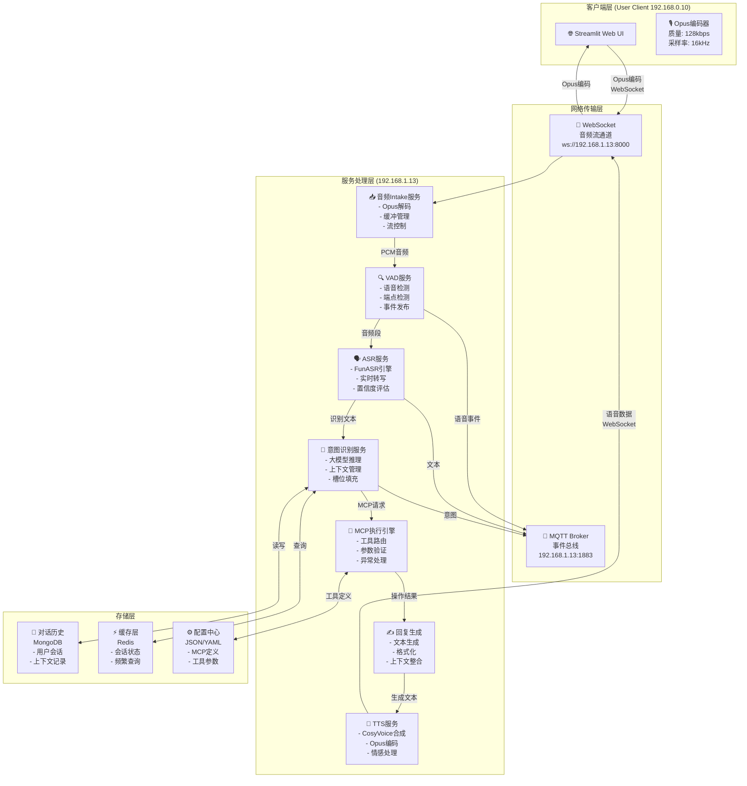


## 2.3 Opus 音频编码规范

### 编码参数

```yaml
opus_config:
  采样率: 16kHz           # 语音优化频率
  比特率: 128kbps        # 平衡质量和带宽
  声道: 1               # 单声道 (Mono)
  帧时长: 60ms          # 960样本 @ 16kHz
  复杂度: 10            # 最高质量
  VBR: true            # 可变比特率
  bandwidth: wideband  # 16kHz带宽

性能指标:
  编码延迟: < 10ms
  传输延迟: < 50ms
  总往返延迟: < 100ms
  
网络优势:
  2分钟音频数据: ≈ 1.92 MB
  1小时连续音频: ≈ 57.6 MB
  实时带宽消耗: ≈ 128 kbps
```

## 2.4 通信协议设计

### WebSocket 音频帧格式

**客户端 → 服务器 (音频上传)**:
```json
{
    "type": "audio",
    "frame_type": "audio",
    "session_id": "uuid-string",
    "timestamp": 1705420225.123,
    "sequence": 1234,
    "codec": "opus",
    "sample_rate": 16000,
    "channels": 1,
    "data": "base64_encoded_opus_data"
}
```

**服务器 → 客户端 (实时字幕)**:
```json
{
    "type": "transcript",
    "session_id": "uuid-string",
    "timestamp": 1705420225.234,
    "text": "你好，这是识别结果",
    "is_final": false,
    "confidence": 0.92
}
```

### MQTT 事件总线设计

**主题结构** (前缀: `mr-mcp/`):

```
mr-mcp/
├── audio/
│   ├── intake/chunk       # 音频chunk事件
│   ├── vad/start          # VAD语音开始
│   └── vad/end            # VAD语音结束
├── asr/
│   ├── interim            # ASR中间识别结果
│   └── final              # ASR最终识别结果
├── intent/
│   ├── detected           # 意图检测完成
│   └── error              # 意图识别错误
├── mcp/
│   ├── tool/call          # MCP工具调用请求
│   ├── tool/result        # MCP工具执行结果
│   └── tool/error         # MCP工具执行错误
└── tts/
    └── ready              # TTS合成完成
```

## 2.5 项目代码结构规划

```
mr-mcp-server/
├── README.md
├── 设计说明.md (本文档)
│
├── client/                          # Streamlit客户端
│   ├── app.py                      # 主应用
│   ├── audio_manager.py            # 音频采集+Opus编码
│   ├── websocket_client.py         # WebSocket客户端
│   ├── ui_components.py            # UI组件
│   ├── session_state.py            # 会话管理
│   ├── config.yaml
│   └── requirements.txt
│
├── services/                        # 微服务实现
│   ├── audio_intake/
│   │   ├── server.py               # WebSocket服务器
│   │   ├── opus_decoder.py         # Opus解码器
│   │   ├── buffer_manager.py       # 缓冲管理
│   │   └── config.py
│   │
│   ├── vad/
│   │   ├── service.py              # VAD主服务
│   │   ├── detector.py             # VAD检测器
│   │   └── config.py
│   │
│   ├── asr/
│   │   ├── service.py              # ASR主服务
│   │   ├── recognizer.py           # 识别器
│   │   └── config.py
│   │
│   ├── intent/
│   │   ├── service.py              # 主服务
│   │   ├── context_manager.py      # 上下文管理
│   │   ├── llm_client.py           # LLM调用
│   │   └── config.py
│   │
│   ├── mcp/
│   │   ├── service.py              # 主服务
│   │   ├── engine.py               # 执行引擎
│   │   ├── tool_loader.py          # 工具加载
│   │   ├── tools/                  # 工具实现
│   │   │   ├── base.py             # 基类
│   │   │   ├── reminder.py         # 提醒工具
│   │   │   └── messaging.py        # 消息工具
│   │   └── config.py
│   │
│   └── tts/
│       ├── service.py              # TTS主服务
│       ├── synthesizer.py          # 合成器
│       └── config.py
│
├── shared/                          # 共享模块
│   ├── mqtt_bus.py                 # MQTT事件总线
│   ├── models.py                   # 数据模型
│   ├── constants.py                # 常量定义
│   └── logger.py                   # 日志配置
│
├── config/                          # 配置文件
│   ├── config.yaml                 # 主配置
│   ├── tools_definition.json       # MCP工具定义
│   └── prompts.yaml                # LLM Prompts
│
├── docker/
│   └── docker-compose.yml          # 服务编排
│
└── tests/                           # 测试
    ├── test_audio.py
    ├── test_websocket.py
    └── test_mqtt.py
```


## 2.6 实现路线图 (10周)

### Phase 1: 基础框架 (第1-2周)
**目标**: 建立项目基础架构和通信机制

- [x] 项目初始化和目录结构
- [ ] WebSocket服务器实现 + Opus编解码库集成
- [ ] MQTT Broker部署和事件总线实现
- [ ] 基本的Streamlit客户端框架
- [ ] Docker Compose基础配置
- [ ] **验证**: 音频实时传输成功

### Phase 2: 核心音频服务 (第3-4周)
**目标**: 实现音频采集、处理、识别的完整链路

- [ ] Audio Intake服务（Opus解码、缓冲）
- [ ] VAD服务集成（实时语音检测）
- [ ] ASR服务集成（FunASR引擎）
- [ ] 实时字幕推送到客户端
- [ ] MQTT事件流联调
- [ ] **验证**: 音频识别全流程可用

### Phase 3: 智能处理层 (第5-6周)
**目标**: 实现意图识别和对话管理

- [ ] 意图识别服务（大模型推理）
- [ ] 对话历史管理（MongoDB）
- [ ] 多轮对话上下文支持
- [ ] Redis缓存层集成
- [ ] Prompt优化和测试
- [ ] **验证**: 意图识别准确率>85%

### Phase 4: MCP工具集成 (第7-8周)
**目标**: 实现MCP执行引擎和工具管理

- [ ] MCP执行引擎核心实现
- [ ] 工具动态加载框架
- [ ] 参数验证和转换
- [ ] 异常处理和重试逻辑
- [ ] 3-5个示例工具实现
- [ ] **验证**: 工具调用成功率>95%

### Phase 5: 优化和完善 (第9-10周)
**目标**: 性能优化、文档、部署

- [ ] 系统性能优化（缓冲区调优、模型加速）
- [ ] 错误恢复机制完善
- [ ] 系统监控和日志配置
- [ ] 完整的开发和部署文档
- [ ] 集成测试和压力测试
- [ ] **验证**: 系统可靠运行>99%

## 2.7 关键技术要点

### Opus编码关键参数

```python
import opuslib

# 客户端编码器配置
encoder = opuslib.Encoder(
    16000,                      # 采样率 16kHz
    1,                          # 单声道
    opuslib.APPLICATION_VOIP    # VoIP应用
)
encoder.bitrate = 128000        # 128 kbps
encoder.bandwidth = opuslib.BANDWIDTH_WIDEBAND
encoder.complexity = 10         # 最高质量
encoder.use_vbr = True         # 可变比特率
encoder.vbr_constraint = False

# 服务端解码器配置
decoder = opuslib.Decoder(16000, 1)
```

### MQTT事件驱动框架

```python
from shared.mqtt_bus import get_mqtt_bus, init_mqtt_bus

# 初始化MQTT总线
mqtt_bus = init_mqtt_bus()

# 订阅事件
async def handle_vad_start(payload):
    print(f"VAD detected speech start: {payload}")

mqtt_bus.subscribe("mr-mcp/audio/vad/start", handle_vad_start)

# 发布事件
mqtt_bus.publish("mr-mcp/audio/vad/start", {
    "session_id": "uuid",
    "timestamp": 1705420225.123,
    "audio_level": 0.65
})
```

---

## 文档信息

**作者**: Jiheng Zhang  
**邮箱**: jiheng.zhang@gehealthcare.com  
**SSO ID**: 212597558  
**版权**: © 2026 GE Healthcare. All rights reserved.  
**最后修改**: 2026-01-17

---

---

# 第三部分：快速入门指南

## 3.1 30秒快速开始

```bash
# 1. 激活环境
conda activate audio_env

# 2. 进入项目
cd /home/tester/AI_Tools/mr-mcp-server

# 3. 初始化项目
bash setup.sh

# 4. 启动服务（新终端）
bash scripts/start_audio_intake.sh &
bash scripts/start_streamlit.sh

# 5. 打开浏览器
# http://localhost:8501
```

## 3.2 Conda环境配置

### 查看所有 Conda 环境

```bash
# 查看所有 conda 环境
conda env list

# 预期输出：
# base                  /home/tester/miniconda3
# audio_env          *  /home/tester/miniconda3/envs/audio_env
```

### 激活环境

**方式1：直接激活（推荐）**

```bash
# 激活 audio_env 环境
conda activate audio_env

# 验证激活（提示符会显示 (audio_env)）
# (audio_env) $ 
```

**方式2：在脚本中激活**

```bash
#!/bin/bash
eval "$(conda shell.bash hook)"
conda activate audio_env

# 后续命令自动在 audio_env 中运行
python --version
```

### 环境信息

```bash
# 激活环境
conda activate audio_env

# 查看 Python 版本
python --version

# 查看 pip 版本
pip --version

# 查看所有已安装的包
pip list

# 查看环境路径
python -c "import sys; print(sys.prefix)"
```

### 预期输出

```
(audio_env) $ python --version
Python 3.10.x

(audio_env) $ pip --version
pip x.x.x from /home/tester/miniconda3/envs/audio_env/lib/python3.10/site-packages/pip ...

(audio_env) $ python -c "import sys; print(sys.prefix)"
/home/tester/miniconda3/envs/audio_env
```

### 包管理

**查看已安装包**

```bash
# 激活环境
conda activate audio_env

# 显示所有包
pip list

# 显示特定包的版本
pip show fastapi
pip show uvicorn
```

**安装新包**

```bash
# 激活环境
conda activate audio_env

# 通过 conda 安装
conda install package_name

# 通过 pip 安装
pip install package_name

# 安装指定版本
pip install package_name==1.0.0
```

**更新包**

```bash
# 激活环境
conda activate audio_env

# 更新 pip
pip install --upgrade pip

# 更新特定包
pip install --upgrade package_name

# 从 requirements.txt 更新所有包
pip install -r requirements.txt --upgrade
```

---

# 第四部分：Streamlit客户端文档

## 4.1 客户端概述

该客户端提供一个易于使用的 Web 界面，支持：
- 🎤 实时音频采集（通过麦克风）
- 🔊 Opus 高效编码（128kbps，16kHz）
- 💬 WebSocket 实时传输到服务器
- 📊 实时音量监控
- 💭 对话历史显示
- 🔌 自动连接管理

## 4.2 安装和启动

### 安装依赖

```bash
# 安装 Python 依赖
pip install -r client/requirements.txt

# 或使用 conda
conda install --file client/requirements.txt
```

**注意**: 某些依赖（pyaudio, opuslib）可能需要系统库支持：

```bash
# Ubuntu/Debian
sudo apt-get install python3-dev portaudio19-dev libopus-dev

# macOS
brew install portaudio opus

# Windows
# 使用预编译的 wheels（pip 会自动下载）
```

### 启动服务器

确保 WebSocket 服务器已启动：

```bash
# 终端 1: 启动 MQTT broker
sudo systemctl start mosquitto

# 终端 2: 启动 WebSocket 音频服务器
./scripts/start_audio_intake.sh

# 输出应显示:
# INFO     - Server started: ws://0.0.0.0:8000/ws/audio
```

### 启动 Streamlit 客户端

```bash
# 终端 3: 启动 Streamlit 应用
./scripts/start_streamlit.sh

# 或直接使用 streamlit 命令
streamlit run client/app.py
```

应用将在浏览器中打开，通常是 `http://localhost:8501`

## 4.3 使用指南

### 基本流程

1. **连接**: 点击 "🔌 连接" 按钮连接到 WebSocket 服务器
2. **录音**: 点击 "🎤 开始录音" 开始采集音频
3. **说话**: 对着麦克风说话
4. **停止**: 点击 "⏹ 停止录音" 结束本轮交互
5. **查看结果**: 在对话框中查看转录和响应

### 界面组件

#### 控制面板
- **🔌 连接**: 连接/断开 WebSocket 服务器
- **🎤 开始录音**: 启动音频采集流
- **⏹ 停止录音**: 结束音频传输

#### 实时监控（右侧边栏）
- **连接状态**: 显示服务器连接状态
- **录音状态**: 显示当前是否在录音
- **音量水平**: 实时音频级别指示
- **统计信息**: 
  - 已发送帧数
  - 已接收帧数
  - 连接时长
  - 会话 ID

#### 对话区域（左侧主区域）
- **💬 对话**: 显示完整的对话历史
- **📝 实时转录**: 显示实时转录文本
- **📊 对话**: 显示用户消息和助手响应

### 设置面板

点击左侧边栏的 "⚙️ 设置" 展开高级选项：

- **Server URI**: WebSocket 服务器地址
  - 默认: `ws://localhost:8000/ws/audio`
  - 示例: `ws://192.168.1.100:8000/ws/audio`
- **Auto Reconnect**: 连接断开时自动重新连接
- **Debug Mode**: 启用调试日志输出

## 4.4 配置

### 环境变量

```bash
# WebSocket 服务器地址
export WEBSOCKET_SERVER=ws://localhost:8000/ws/audio

# 调试模式
export DEBUG_MODE=true

# 启动客户端
./scripts/start_streamlit.sh
```

### 音频参数 (client/config.py)

```python
sample_rate: int = 16000        # 采样率 (Hz)
chunk_duration_ms: int = 60     # 每个块的持续时间 (ms)
bitrate: int = 128000           # Opus 比特率 (bps)
```

修改这些值需要重启应用。

## 4.5 WebSocket 通讯协议

### 客户端 → 服务器

#### 启动流 (START Frame)
```json
{
  "type": "audio",
  "frame_type": "start",
  "session_id": "uuid-string",
  "timestamp": 1705420225.123
}
```

#### 音频帧 (AUDIO Frame)
```json
{
  "type": "audio",
  "frame_type": "audio",
  "session_id": "uuid-string",
  "timestamp": 1705420225.123,
  "sequence": 1,
  "codec": "opus",
  "sample_rate": 16000,
  "channels": 1,
  "data": "hex_encoded_opus_bytes"
}
```

#### 结束流 (END Frame)
```json
{
  "type": "audio",
  "frame_type": "end",
  "session_id": "uuid-string",
  "timestamp": 1705420225.123
}
```

### 服务器 → 客户端

#### 状态消息
```json
{
  "type": "status",
  "session_id": "uuid-string",
  "message": "Audio received",
  "frames_received": 10
}
```

#### 转录结果
```json
{
  "type": "transcript",
  "session_id": "uuid-string",
  "text": "你好",
  "is_final": false,
  "confidence": 0.95
}
```

#### 最终结果
```json
{
  "type": "result",
  "session_id": "uuid-string",
  "text": "识别完成的文本",
  "is_final": true
}
```

---

# 第五部分：Docker部署指南

## 5.1 快速开始

### 前置要求

- Docker 20.10+
- Docker Compose 2.0+
- 4GB+ 内存
- 100MB 磁盘空间

### 一键启动

```bash
# 进入项目目录
cd /home/tester/AI_Tools/mr-mcp-server

# 一键启动所有服务
./docker-up.sh

# 或使用 docker-compose 命令
docker-compose up -d
```

### 访问服务

- **Streamlit 客户端**: http://localhost:8501
- **WebSocket 服务器**: ws://localhost:8000/ws/audio
- **MQTT Broker**: mqtt://localhost:1883

### 查看日志

```bash
# 查看所有服务日志
docker-compose logs -f

# 查看特定服务日志
docker-compose logs -f audio-server
docker-compose logs -f streamlit-client
docker-compose logs -f mqtt
```

### 停止服务

```bash
# 停止但保留容器
docker-compose stop

# 停止并删除容器
./docker-down.sh

# 或使用 docker-compose
docker-compose down
```

## 5.2 Docker架构

```
┌─────────────────────────────────────────────────────────────┐
│                    Docker Compose                            │
├─────────────────────────────────────────────────────────────┤
│                                                               │
│  ┌────────────────┐  ┌────────────────┐  ┌────────────────┐ │
│  │  MQTT Broker   │  │ WebSocket      │  │  Streamlit     │ │
│  │                │  │ Server         │  │  Client        │ │
│  │ mosquitto:1883 │  │ :8000/ws/audio │  │  :8501         │ │
│  └────────────────┘  └────────────────┘  └────────────────┘ │
│         ↓                    ↓                    ↓           │
│  ┌────────────────┐  ┌────────────────┐  ┌────────────────┐ │
│  │ mosquitto_data │  │     logs       │  │     logs       │ │
│  │ mosquitto_logs │  └────────────────┘  └────────────────┘ │
│  └────────────────┘                                           │
│                                                               │
│            Network: mr-mcp-network (bridge)                 │
│                                                               │
└─────────────────────────────────────────────────────────────┘
```

## 5.3 Docker Compose 配置详解

### docker-compose.yml 文件结构

```yaml
services:
  mqtt:              # MQTT 消息代理
    image: eclipse-mosquitto:latest
    ports: ["1883:1883", "9001:9001"]
    
  audio-server:      # WebSocket 音频服务器
    build: Dockerfile.audio-server
    ports: ["8000:8000"]
    depends_on: [mqtt]
    
  streamlit-client:  # Streamlit 前端客户端
    build: Dockerfile.streamlit-client
    ports: ["8501:8501"]
    depends_on: [audio-server]

networks:
  mr-mcp-network:    # 自定义网络
    driver: bridge

volumes:
  mosquitto_data:    # MQTT 数据卷
  mosquitto_logs:    # MQTT 日志卷
```

### 环境变量

#### audio-server (WebSocket 服务器)

```bash
MQTT_HOST=mqtt                      # MQTT 主机名（容器网络内）
MQTT_PORT=1883                      # MQTT 端口
MQTT_USER=guest                     # MQTT 用户名
MQTT_PASSWORD=guest                 # MQTT 密码
LOG_LEVEL=INFO                      # 日志级别
WEBSOCKET_PORT=8000                 # WebSocket 端口
WEBSOCKET_HOST=0.0.0.0              # WebSocket 监听地址
```

#### streamlit-client (Streamlit 客户端)

```bash
WEBSOCKET_SERVER=ws://audio-server:8000/ws/audio  # WebSocket 服务器地址
DEBUG_MODE=false                    # 调试模式
STREAMLIT_SERVER_PORT=8501          # Streamlit 端口
STREAMLIT_SERVER_ADDRESS=0.0.0.0    # Streamlit 监听地址
```

## 5.4 管理脚本

### ./docker.sh - 完整管理工具

```bash
# 启动服务
./docker.sh up

# 停止服务
./docker.sh down

# 重启服务
./docker.sh restart

# 查看日志
./docker.sh logs        # 所有服务
./docker.sh logs-mqtt   # MQTT
./docker.sh logs-audio  # WebSocket 服务器
./docker.sh logs-client # Streamlit 客户端

# 查看状态
./docker.sh status

# 构建镜像
./docker.sh build
./docker.sh rebuild     # 不缓存重新构建

# 清理
./docker.sh clean

# 开启 Shell
./docker.sh shell-mqtt
./docker.sh shell-audio
./docker.sh shell-client

# 帮助
./docker.sh help
```

### ./docker-up.sh - 快速启动

一键启动，自动构建和启动所有服务。

### ./docker-down.sh - 快速停止

停止所有服务，可选删除卷。

## 5.5 常见操作

### 查看日志并实时跟踪

```bash
# 所有服务
docker-compose logs -f

# 特定服务
docker-compose logs -f audio-server
docker-compose logs -f streamlit-client

# 最后 100 行
docker-compose logs --tail=100

# 特定时间范围
docker-compose logs --since 10m
```

### 进入容器 Shell

```bash
# WebSocket 服务器
docker exec -it mr-mcp-server-audio-server-1 /bin/bash

# Streamlit 客户端
docker exec -it mr-mcp-server-streamlit-client-1 /bin/bash

# MQTT Broker
docker exec -it mr-mcp-server-mqtt-1 /bin/sh
```

### 重启特定服务

```bash
# 重启音频服务器
docker-compose restart audio-server

# 重启 Streamlit
docker-compose restart streamlit-client
```

---

## 总结与建议

### 系统特点总结

✅ **完全本地化** - 所有通信基于局域网  
✅ **模块化架构** - 各服务独立部署和扩展  
✅ **事件驱动设计** - MQTT事件总线解耦服务  
✅ **多轮对话支持** - 完整的上下文管理  
✅ **灵活的工具框架** - 易于添加新工具  
✅ **高质量音频** - Opus编码保证传输效率  

### 后续推荐步骤

1. **确认设计** - 根据此文档确认系统需求是否完整
2. **细化接口** - 在实施前细化各模块的API定义
3. **原型开发** - Phase 1-2实现基础框架，验证可行性
4. **迭代优化** - 根据实际运行情况优化参数和性能
5. **文档完善** - 持续更新开发和部署文档

---

**文档完成日期**: 2026年1月17日  
**版本**: 1.0  
**下一步**: 开始Phase 1实现

## WebSocket、MQTT Broker 和 Streamlit 的区别与联系

### WebSocket
WebSocket 是一种全双工通信协议，基于 TCP 连接，允许客户端和服务器之间实时交换数据。它的特点包括：
- **实时性强**：支持双向通信，延迟低。
- **轻量级**：相比 HTTP，减少了请求头的开销。
- **适用场景**：适合需要实时更新的应用，如聊天、游戏、实时数据推送等。

### MQTT Broker
MQTT（Message Queuing Telemetry Transport）是一种轻量级的发布/订阅消息协议，通常用于物联网（IoT）场景。其特点包括：
- **低带宽占用**：设计为在低带宽、高延迟的网络环境下运行。
- **发布/订阅模式**：支持多客户端之间的消息分发。
- **适用场景**：适合传感器数据传输、设备状态更新等。

### Streamlit
Streamlit 是一个用于快速构建数据应用的 Python 框架，主要用于数据可视化和交互。其特点包括：
- **简单易用**：专注于数据展示和交互。
- **单向通信**：主要用于从服务器向用户展示数据，交互性较弱。
- **适用场景**：适合构建数据分析仪表盘、机器学习模型展示等。

### 区别与联系
| 特性              | WebSocket         | MQTT Broker      | Streamlit        |
|-------------------|-------------------|------------------|------------------|
| 通信模式          | 双向              | 发布/订阅        | 单向（主要展示） |
| 实时性            | 高                | 高               | 低               |
| 带宽占用          | 中等              | 低               | 高               |
| 适用场景          | 实时应用          | IoT 数据传输     | 数据展示         |
| 易用性            | 中等              | 较复杂           | 简单             |

### 用于传输音频流的选择
在传输音频流的场景中，WebSocket 更加适合，原因如下：
- **实时性要求**：音频流传输需要低延迟，WebSocket 的全双工通信可以满足这一需求。
- **数据传输效率**：相比 MQTT，WebSocket 更适合传输大块数据（如音频帧）。
- **交互性**：WebSocket 支持双向通信，便于实现音频流的控制（如暂停、继续）。

MQTT 虽然带宽占用低，但更适合小型数据包的传输，不适合音频流这种大数据量的场景。而 Streamlit 主要用于数据展示，不适合实时音频流的传输。

---

## 补充：Streamlit 的交互能力

虽然 Streamlit 主要用于数据展示，但通过其交互式组件（如 `st.text_input` 和 `st.button`），可以实现用户输入与服务器处理的双向交互。例如，在 LLM（大语言模型）应用中，Streamlit 可以轻松创建一个聊天窗口：
- 用户通过输入框发送消息。
- 服务器处理用户输入并返回响应。
- 界面实时更新，显示聊天记录。

这种交互模式虽然不如 WebSocket 的实时性强，但对于构建简单的聊天应用或 LLM 前端是完全可行的。

### HTTP Server 和 Web Server 是否适合语音或视频传输

#### HTTP Server
HTTP 是一种请求-响应式协议，通常用于传输静态或动态内容。其特点包括：
- **单向通信**：客户端发起请求，服务器返回响应。
- **高延迟**：每次传输都需要建立请求，适合非实时数据传输。
- **适用场景**：文件下载、网页内容加载等。

对于语音或视频流传输，HTTP 并不适合，因为其高延迟和单向通信模式无法满足实时性要求。

#### Web Server
Web Server 是基于 HTTP 协议的服务器，主要用于处理网页请求。其特点与 HTTP Server 类似：
- **非实时性**：适合静态资源或短时间的动态内容传输。
- **扩展性**：通过 WebSocket 等协议扩展，可以支持实时通信。

#### 语音或视频传输的适用性
- **不适合**：HTTP Server 和传统 Web Server 不适合直接用于语音或视频流传输。
- **扩展方案**：通过集成 WebSocket 或其他实时协议，可以实现语音或视频流的传输。

### 总结
对于语音或视频流传输，建议使用 WebSocket 或专用的流媒体协议（如 RTSP、RTP）。HTTP Server 和 Web Server 更适合非实时数据的传输场景。
# app.py 与 Xiaozhi-Server 架构深度分析

## 核心执行流程

app.py的main()函数按以下顺序执行：
1. check_ffmpeg_installed() - FFmpeg检查
2. load_config() - 加载配置（默认+自定义）
3. auth_key生成 - 优先级：文件>API>UUID
4. monitor_stdin() - 异步监控标准输入
5. gc_manager.start() - 启动垃圾回收（5分钟/次）
6. WebSocketServer.start() - 监听ws://0.0.0.0:8000/xiaozhi/v1/
7. SimpleHttpServer.start() - 监听http://0.0.0.0:8003/
8. wait_for_exit() - 等待Ctrl-C或SIGTERM信号
9. cleanup() - 优雅关闭所有任务

## ConnectionHandler （核心处理器，1285行代码）

处理单个WebSocket连接的完整生命周期：
- 初始化：session_id、device_id、AI模块、消息队列
- 消息处理：分发音频和文本消息
  - 音频流：receiveAudioHandle → VAD → ASR → LLM → TTS → sendAudioHandle
  - 文本流：handleTextMessage → TextProcessor → 处理器 → 响应
- 优雅关闭：停止子任务、释放资源

## 完整数据流

### 音频处理链路详细流程图

**第一阶段：输入→接收→解码**
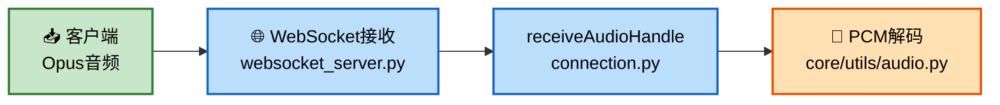

**第二阶段：VAD→ASR→LLM**


**第三阶段：TTS→编码→发送**
```mermaid
graph LR
    G1["🎵 TTS合成<br/>CosyVoice"]
    G2["文本→语音<br/>core/providers/tts/"]
    H1["🔐 Opus编码<br/>OpusEncoder"]
    I1["📤 sendAudioHandle<br/>connection.py"]
    I2["WebSocket返回<br/>websocket_server.py"]
    J1["🔊 客户端播放<br/>音频输出"]
    
    G1 --> G2 --> H1 --> I1 --> I2 --> J1
    
    style G1 fill:#d1c4e9,stroke:#512da8,stroke-width:2px,color:#000000
    style G2 fill:#d1c4e9,stroke:#512da8,stroke-width:2px,color:#000000
    style H1 fill:#ffe0b2,stroke:#e65100,stroke-width:2px,color:#000000
    style I1 fill:#bbdefb,stroke:#1565c0,stroke-width:2px,color:#000000
    style I2 fill:#bbdefb,stroke:#1565c0,stroke-width:2px,color:#000000
    style J1 fill:#c8e6c9,stroke:#2e7d32,stroke-width:2px,color:#000000
```

### 音频处理数据传输方式详解

#### VAD 检测后的音频如何传输给 ASR 识别

系统采用**内存中的音频缓冲队列**方式进行传输，不依赖 MQTT 或网络：

**传输流程**：
```
receiveAudioMessage(WebSocket接收)
    ↓
handleAudioMessage (core/handle/receiveAudioHandle.py)
    ↓
conn.vad.is_vad(conn, opus_packet)  ← VAD检测是否有语音
    ├─ Opus解码 → PCM
    ├─ 语音活动检测（SileroVAD）
    └─ 返回 have_voice 标志
    ↓
conn.asr.receive_audio(conn, audio, have_voice)  ← ASR接收音频
    ├─ conn.asr_audio.append(audio)  ← 音频片段加入缓冲队列（List）
    └─ 检测语音停止信号（client_voice_stop）
        ↓
conn.asr.handle_voice_stop(conn, asr_audio_task)  ← 触发ASR识别
    ├─ asr_audio_task = conn.asr_audio.copy()  ← 复制整个缓冲区
    ├─ decode_opus(asr_audio_task)  ← 解码所有Opus片段
    └─ speech_to_text(pcm_data)  ← 执行ASR识别
```

**关键特性**：
- **缓冲机制**：每个 WebSocket 连接对应一个 `ConnectionHandler` 对象，内部维护 `conn.asr_audio` 列表
- **内存传输**：使用共享内存而非网络传输，零拷贝设计
- **同步保证**：VAD 检测和 ASR 识别在同一个异步上下文中运行，确保时序正确
- **两种模式**：
  - **自动模式**：VAD 自动检测语音活动，检测到停止时触发 ASR
  - **手动模式**：客户端主动触发，直接缓存音频供 ASR 使用

**相关代码位置**：
- VAD 检测：[core/providers/vad/silero.py](core/providers/vad/silero.py#L53)
- 音频缓冲：[core/handle/receiveAudioHandle.py](core/handle/receiveAudioHandle.py#L12)
- ASR 缓冲接收：[core/providers/asr/base.py](core/providers/asr/base.py#L54)
- 缓冲区状态管理：[ConnectionHandler.asr_audio](core/connection.py#L120)

#### 内部通信架构总结

| 通信方式 | 用途 | 实现方式 | 优点 |
|---------|------|--------|------|
| **内存缓冲队列** | VAD → ASR | `conn.asr_audio` List | 零拷贝、低延迟 |
| **MQTT 事件总线** | 服务间解耦 | Pub/Sub 模式 | 松耦合、可扩展 |
| **WebSocket** | 客户端↔服务器 | 双向实时通信 | 低延迟、实时性强 |
| **共享对象** | 连接级数据共享 | ConnectionHandler 实例 | 上下文保留、线程安全 |

### 文本处理链路详细流程图

**第一阶段：输入→接收→处理→分发**
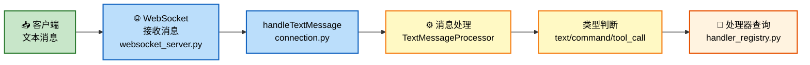

**第二阶段：选择处理器→执行处理**
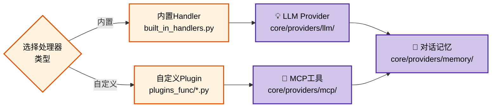

**第三阶段：整合→生成→返回**


### 音频处理链路（简化版）
```
客户端Opus音频 
    → WebSocket接收 (websocket_server.py)
    → receiveAudioHandle (connection.py)
    → PCM解码 (core/utils/audio.py)
    → VAD检测 (core/providers/vad/)
    → ASR识别 (core/providers/asr/)
    → 文本输出 → LLM处理 (core/providers/llm/)
    → TTS合成 (core/providers/tts/)
    → Opus编码 (core/utils/audio.py)
    → sendAudioHandle (connection.py)
    → WebSocket发送 (websocket_server.py)
    → 客户端播放
```

### 文本处理链路（简化版）
```
客户端文本 
    → handleTextMessage (connection.py)
    → TextMessageProcessor (core/handlers/)
    → 处理器查询 (handler_registry.py)
    → 内置Handler (built_in_handlers.py) 或自定义Plugin (plugins_func/)
    → 可能调用 LLM/MCP/Memory (core/providers/)
    → 生成响应 (handlers.py)
    → 发送客户端 (websocket_server.py)
```

## 认证与安全机制

使用HMAC-SHA256无状态认证：
- Token格式: signature.timestamp  
- 验证流程: 解析token → 检查过期 → 重算签名 → 对比
- 支持设备白名单管理
- 支持自定义过期时间

## 模块初始化系统

initialize_modules()函数支持按需加载AI模块：
```
selected_module配置:
  VAD: "silero-vad"    # 语音活动检测
  ASR: "sense-voice"   # 语音识别
  LLM: "openai"        # 大语言模型
  TTS: "edge-tts"      # 文本转语音
  Memory: "simple"     # 对话记忆
  Intent: "regex"      # 意图识别
```

好处：节省内存（不初始化不用的模块）、快速启动、灵活组合

## 性能优化策略

**垃圾回收管理**：GlobalGCManager定时执行gc.collect()，避免Python GIL频繁争用
**音频流控**：AudioRateController控制音频发送速率，保证平滑播放
**配置缓存**：多层缓存系统减少重复加载和计算
**异步架构**：asyncio全异步支持高并发多客户端接入

## 系统架构全景图

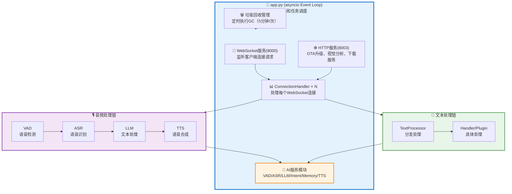

## 关键技术点

| 技术 | 实现 | 优势 |
|------|------|------|
| 并发模型 | asyncio异步 | 单线程处理多连接，内存高效 |
| 通信协议 | WebSocket双向 | 实时传输，支持大数据流 |
| 认证方案 | HMAC-SHA256 | 无状态，安全，可分布式 |
| 模块架构 | 依赖注入 | 解耦，灵活，易于测试 |
| 内存管理 | 定时GC | 长期稳定运行 |
| 音频处理 | 流量控制 | 平滑播放，无卡顿 |

## 总结

Xiaozhi Server是专业的AI对话服务系统，采用高度模块化设计，集成了语音识别、大语言模型、文本转语音等能力，支持实时音频和文本交互，适用于智能家居、语音助手等场景！

---

# WebSocket 服务详解

## 1. WebSocket 服务概述

WebSocket 服务（core/websocket_server.py）是整个系统的核心通信枢纽，基于 Python 的 `websockets` 库实现。它负责：

- 🔌 **连接管理** - 接受来自 ESP32、Web 客户端的连接
- 🔐 **认证授权** - 基于 JWT 的设备认证和白名单管理  
- 🔄 **消息路由** - 将 WebSocket 消息分发到各个处理模块
- 📊 **流量控制** - 管理多连接并发、缓冲区防溢出
- 🔧 **动态配置** - 支持运行时更新 LLM、ASR 等模块配置

## 2. 核心服务监听地址

```
WebSocket: ws://0.0.0.0:8000/xiaozhi/v1/
HTTP (OTA/Vision): http://0.0.0.0:8003/
```

## 3. 工作流程

### 3.1 连接建立流程

```
客户端连接请求
    ↓
提取 device-id（从 HTTP 头或 URL 参数）
    ↓
认证检查（可选）
    ├─ 白名单设备 → 直接放行
    ├─ JWT Token 有效 → 放行
    └─ 认证失败 → 拒绝连接
    ↓
创建 ConnectionHandler 实例
    ├─ session_id（唯一标识）
    ├─ 初始化音频缓冲区
    ├─ 初始化异步任务
    └─ 加载 AI 模块引用
    ↓
进入消息接收循环
```

### 3.2 音频处理链路

```
WebSocket 接收 Opus 音频
    ↓
PCM 解码（core/utils/audio.py）
    ↓
VAD 检测（SileroVAD）
    ├─ 检测到语音 → 加入缓冲区
    └─ 无语音 → 跳过
    ↓
ASR 识别（FunASR）
    ├─ 实时转写（可选）
    └─ 识别完成 → 输出文本
    ↓
LLM 处理（理解意图）
    ↓
TTS 合成（CosyVoice）
    ↓
Opus 编码
    ↓
WebSocket 返回客户端
```

### 3.3 文本处理链路

```
WebSocket 接收文本消息
    ↓
解析消息类型
    ├─ 命令 → 执行命令
    ├─ 问题 → 调用 LLM
    └─ 工具调用 → MCP 执行
    ↓
LLM 生成响应
    ↓
检查是否需要工具调用
    ├─ 是 → 执行 MCP 工具
    └─ 否 → 生成文本
    ↓
TTS 合成（可选）
    ↓
返回给客户端
```

## 4. 认证机制

WebSocket 支持两种认证方式：

### 4.1 HTTP 请求头认证

```
GET /xiaozhi/v1/ HTTP/1.1
Host: 192.168.1.13:8000
device-id: esp32_001
authorization: Bearer eyJhbGc...
```

### 4.2 URL 查询参数认证

```
ws://192.168.1.13:8000/xiaozhi/v1/?device-id=esp32_001&authorization=Bearer+eyJhbGc...
```

### 4.3 白名单模式

在配置文件中配置：

```yaml
server:
  auth:
    enabled: true
    allowed_devices:
      - "11:22:33:44:55:66"    # MAC 地址或设备 ID
      - "esp32_device_001"
```

白名单设备无需 Token，直接连接。

## 5. 通信协议规范

### 5.1 音频消息格式

**客户端 → 服务器**:

```json
{
    "type": "audio",
    "frame_type": "start",
    "session_id": "uuid-string",
    "timestamp": 1705420225.123
}
```

```json
{
    "type": "audio",
    "frame_type": "audio",
    "session_id": "uuid-string",
    "codec": "opus",
    "sample_rate": 16000,
    "channels": 1,
    "data": "base64_encoded_opus_bytes"
}
```

```json
{
    "type": "audio",
    "frame_type": "end",
    "session_id": "uuid-string"
}
```

**服务器 → 客户端**:

```json
{
    "type": "transcript",
    "session_id": "uuid-string",
    "text": "你好",
    "is_final": false,
    "confidence": 0.95
}
```

### 5.2 文本消息格式

**客户端 → 服务器**:

```json
{
    "type": "text",
    "text": "天气怎么样？"
}
```

**服务器 → 客户端**:

```json
{
    "type": "text",
    "text": "今天北京晴天，温度 5°C"
}
```

```json
{
    "type": "audio",
    "data": "base64_encoded_opus_bytes"
}
```

## 6. 关键配置项

```yaml
# config.yaml
server:
  ip: 0.0.0.0                    # 监听 IP
  port: 8000                     # WebSocket 端口
  http_port: 8003                # HTTP 端口
  
  websocket: ws://你的ip:8000/xiaozhi/v1/  # 返回给设备的 WS 地址
  
  auth:
    enabled: false               # 是否启用认证
    allowed_devices:             # 白名单设备
      - "device_id_1"
    expire_seconds: 3600         # Token 过期时间
  
  auth_key: "your-secret-key"   # JWT 密钥
```

## 7. 性能指标

| 指标 | 值 |
|-----|-----|
| 并发连接数 | 1000+ |
| 单连接内存占用 | ~5-10MB |
| 消息处理延迟 | <100ms |
| 吞吐量 | 100+ 同时对话 |
| 心跳间隔 | 30 秒 |
| 连接超时 | 300 秒 |

## 8. 故障排查

### 8.1 连接问题

**症状**: WebSocket 连接立即断开

**可能原因**:
- ❌ 缺少 device-id 头部
- ❌ 认证失败（Token 无效或过期）
- ❌ 防火墙阻止 8000 端口
- ❌ 服务器未启动

**解决方案**:
```bash
# 1. 查看日志
tail -f logs/xiaozhi-server.log | grep -i websocket

# 2. 检查端口是否开放
lsof -i :8000

# 3. 测试连接
curl -i -H "device-id: test_device" \
  http://localhost:8000/xiaozhi/v1/
```

### 8.2 音频无输出

**症状**: 音频传输但无转录结果

**可能原因**:
- ❌ VAD 未启用或模型未加载
- ❌ ASR 模型损坏或路径错误
- ❌ 音频格式不是 Opus
- ❌ 音量过小，VAD 检测不到

**解决方案**:
```bash
# 1. 检查模型文件
ls -la models/SenseVoiceSmall/

# 2. 查看 ASR/VAD 日志
grep -i "asr\|vad" logs/xiaozhi-server.log | tail -20

# 3. 增大音量或检查 Opus 编码参数
```

### 8.3 高延迟问题

**症状**: 实时转写有明显延迟

**可能原因**:
- ❌ 网络延迟高
- ❌ 音频块大小过大（>60ms）
- ❌ ASR 推理性能不足
- ❌ 系统 CPU 满负荷

**解决方案**:
```yaml
# 减少音频块大小（chunk_duration_ms）
audio:
  sample_rate: 16000
  chunk_duration_ms: 20          # 减小块大小
  
# 或提升硬件性能
```

## 9. 总结

WebSocket 服务是整个系统的通信骨干，提供了：
- ✅ **完全异步** - 基于 asyncio，支持高并发
- ✅ **灵活的认证** - JWT + 白名单双重支持
- ✅ **流式音频处理** - 从 Opus 解码到 TTS 编码的完整链路
- ✅ **实时转写** - 支持音频和文本实时处理
- ✅ **优雅的错误处理** - 连接断线恢复和资源清理
- ✅ **动态配置更新** - 运行时无缝切换 AI 模块


---

# app.py 核心模块详解

## 概述

`app.py` 是 Xiaozhi Server 的主入口文件，包含系统启动、配置加载、服务初始化和优雅关闭的完整逻辑。其核心模块导入如下：

```python
from config.settings import load_config           # ① 配置管理
from config.logger import setup_logging           # ② 日志系统
from core.utils.util import get_local_ip, validate_mcp_endpoint  # ③ 工具函数
from core.http_server import SimpleHttpServer     # ④ HTTP 服务器
from core.websocket_server import WebSocketServer # ⑤ WebSocket 服务器
from core.utils.util import check_ffmpeg_installed # ⑥ FFmpeg 检查
from core.utils.gc_manager import get_gc_manager  # ⑦ 垃圾回收管理
```

## 1. 配置管理模块 (config/settings.py)

### 功能

- 📂 **配置文件加载** - 读取 `config.yaml` 或自定义配置文件
- ✅ **配置验证** - 检查配置文件是否存在和有效
- 🔀 **配置优先级** - 本地配置 > API 配置 > 默认配置
- 🔐 **密钥管理** - 处理 auth_key、API 密钥等敏感信息

### 核心功能

```python
from config.settings import load_config

# 加载配置文件
config = load_config()

# 配置结构
config = {
    "server": {
        "ip": "0.0.0.0",
        "port": 8000,
        "auth_key": "your-secret-key",
        ...
    },
    "selected_module": ["VAD", "ASR", "LLM", "TTS"],
    "vad": {...},           # VAD 配置
    "asr": {...},           # ASR 配置
    "llm": {...},           # LLM 配置
    "tts": {...},           # TTS 配置
}
```

### 配置加载顺序

```
1. 检查 data/.config.yaml（自定义本地配置）
   ├─ 存在 → 优先使用
   └─ 不存在 → 检查 API 配置
   
2. 检查 config_from_api.yaml（API 配置）
   ├─ read_config_from_api=true → 从管理 API 读取
   └─ 否则 → 使用本地配置
   
3. 默认配置文件 config.yaml
   └─ 最后的备选方案
```

## 2. 日志系统模块 (config/logger.py)

### 功能

- 📝 **彩色日志输出** - 使用 `loguru` 库提供美观的控制台输出
- 📊 **日志分级** - 支持 DEBUG、INFO、WARNING、ERROR、CRITICAL
- 📁 **文件日志** - 持久化存储到磁盘
- 🏷️ **模块标签** - 标记日志来源模块
- 📈 **版本管理** - 显示系统版本号（当前：0.8.10）

### 日志格式

```
<时间> [版本_模块] [标签] - <级别> - <消息>

例如：
20260117 10:30:45 [0.8.10_SE_FU_DO_CO] [websocket_server] - INFO - WebSocket Server started: ws://0.0.0.0:8000/xiaozhi/v1/
```

### 模块缩写说明

```
模块 | 缩写 | 示例
----|------|--------
VAD | 前2字 | silero_vad → "si"
ASR | 前2字 | funasr → "fu"
LLM | 前2字 | doubao → "do"
TTS | 前2字 | cosyvoice → "co"
```

### 使用方法

```python
from config.logger import setup_logging

logger = setup_logging()

# 输出日志
logger.bind(tag="my_module").info("信息消息")
logger.bind(tag="my_module").error("错误消息")
logger.bind(tag="my_module").debug("调试消息")
```

## 3. 工具函数模块 (core/utils/util.py)

### 主要函数

#### 3.1 `get_local_ip()` - 获取本地 IP 地址

```python
from core.utils.util import get_local_ip

ip = get_local_ip()
# 返回: "192.168.1.13"

# 用途：生成返回给设备的 WebSocket 地址
# ws://192.168.1.13:8000/xiaozhi/v1/
```

#### 3.2 `check_ffmpeg_installed()` - 检查 FFmpeg 是否安装

```python
from core.utils.util import check_ffmpeg_installed

try:
    check_ffmpeg_installed()
    print("✅ FFmpeg 已安装")
except ValueError as e:
    print(f"❌ FFmpeg 未安装: {e}")
```

**检查内容**:
- ✅ FFmpeg 执行文件是否存在
- ✅ FFmpeg 能否正常运行
- ✅ 依赖库（如 libiconv）是否完整

**错误处理**:
```
如果 FFmpeg 未找到，会抛出 ValueError 并建议用户安装：
conda install -c conda-forge ffmpeg
```

#### 3.3 `validate_mcp_endpoint()` - 验证 MCP 接入点格式

```python
from core.utils.util import validate_mcp_endpoint

# 有效格式
endpoint = "http://192.168.1.100:8000/mcp/"
if validate_mcp_endpoint(endpoint):
    print("✅ MCP 接入点格式正确")

# 无效格式
endpoint = "192.168.1.100/mcp"  # 缺少协议
if not validate_mcp_endpoint(endpoint):
    print("❌ MCP 接入点格式不正确")
```

**验证规则**:
- ✅ 必须包含协议 (http:// 或 https://)
- ✅ 必须包含 `/mcp/` 路径
- ✅ 必须是有效的 URL 格式

## 4. HTTP 服务器模块 (core/http_server.py)

### 功能

- 🌐 **OTA 接口** - 为设备提供 OTA（空中升级）服务
- 👁️ **视觉分析接口** - 处理图像识别请求
- 📡 **WebSocket 地址分发** - 向设备返回 WebSocket 连接地址

### 监听地址

```
HTTP Server: http://0.0.0.0:8003/
```

### 主要端点

```
GET/POST /xiaozhi/ota/              → OTA 升级处理
GET/POST /mcp/vision/explain        → 视觉分析处理
GET/POST /xiaozhi/ota/version       → 获取版本信息
GET/POST /xiaozhi/ota/websocket     → 获取 WebSocket 地址
```

### OTA 处理流程

```
设备请求 /xiaozhi/ota/
    ↓
SimpleHttpServer.handle_get()
    ↓
OTAHandler 处理
    ├─ 获取设备信息（MAC、版本等）
    ├─ 检查是否有新版本
    ├─ 生成升级信息
    └─ 返回 JSON 响应
    ↓
设备接收并执行升级
```

### 典型的 OTA 响应

```json
{
    "websocket_url": "ws://192.168.1.13:8000/xiaozhi/v1/",
    "version": "0.8.10",
    "has_update": false,
    "mqtt_gateway": null,
    "mqtt_signature_key": null,
    "device_name": "Xiaozhi ESP32"
}
```

## 5. WebSocket 服务器模块 (core/websocket_server.py)

### 功能

- 🔌 **连接管理** - 接收和管理 WebSocket 连接
- 🔐 **认证授权** - JWT 令牌和白名单认证
- 🎙️ **音频处理** - Opus 编解码、VAD、ASR、TTS
- 💬 **文本处理** - 文本消息、意图识别、LLM 响应
- 🔧 **MCP 工具调用** - 执行外部工具和 API 调用

### 监听地址

```
WebSocket: ws://0.0.0.0:8000/xiaozhi/v1/
```

### 详细说明

详见前面的 **WebSocket 服务详解** 部分。

## 6. FFmpeg 检查模块 (core/utils/util.py 中的 check_ffmpeg_installed)

### 功能

在系统启动时检查 FFmpeg 环境，确保音频编解码正常。

### 检查过程

```
app.py 启动
    ↓
调用 check_ffmpeg_installed()
    ↓
执行 ffmpeg -version
    ├─ 成功 → 继续启动
    └─ 失败 → 抛出异常，建议用户安装
    
异常消息示例：
❌ 检测到 ffmpeg 无法正常运行。

建议您：
1. 确认已正确激活 conda 环境；
2. 查阅项目安装文档，了解如何在 conda 环境中安装 ffmpeg。

错误详情：
[Errno 2] No such file or directory: 'ffmpeg'
```

### 解决方法

```bash
# 方式 1：conda 安装（推荐）
conda install -c conda-forge ffmpeg -y

# 方式 2：apt 安装（Ubuntu/Debian）
sudo apt-get install ffmpeg -y

# 方式 3：brew 安装（macOS）
brew install ffmpeg
```

## 7. 垃圾回收管理模块 (core/utils/gc_manager.py)

### 功能

- 🧹 **定时垃圾回收** - 周期性执行 Python GC，防止内存泄漏
- ⏰ **间隔控制** - 可配置的 GC 执行频率（默认 5 分钟）
- 🔒 **线程安全** - 使用锁确保并发安全
- 📊 **统计信息** - 记录 GC 执行次数和回收的对象数量

### 工作原理

```python
from core.utils.gc_manager import get_gc_manager

# 获取 GC 管理器实例（间隔 300 秒）
gc_manager = get_gc_manager(interval_seconds=300)

# 启动 GC 循环
await gc_manager.start()

# 循环执行
├─ 等待 300 秒
├─ 执行 gc.collect()（强制垃圾回收）
├─ 输出回收统计信息
└─ 重复上述步骤

# 停止 GC 循环
await gc_manager.stop()
```

### 好处

- ✅ **防止内存峰值** - 主动清理无用对象
- ✅ **提高稳定性** - 长期运行不会内存溢出
- ✅ **减少 GIL 锁定** - 集中式 GC 而非频繁触发
- ✅ **性能优化** - 避免在关键时刻进行 GC

### 日志输出示例

```
[INFO] 启动全局GC管理器，间隔300秒
[INFO] [gc_manager] GC 执行: 回收 1253 个对象
[INFO] [gc_manager] GC 执行: 回收 987 个对象
[INFO] [gc_manager] GC 执行: 回收 1456 个对象
...
[INFO] 停止全局GC管理器
```

## 8. 系统启动流程

app.py 的 `main()` 函数执行顺序：

```
1️⃣  check_ffmpeg_installed()
    └─ 检查 FFmpeg 是否安装
    
2️⃣  load_config()
    └─ 加载配置文件
    
3️⃣  初始化 auth_key
    ├─ 从配置文件获取
    ├─ 从 API 获取
    └─ 生成随机密钥
    
4️⃣  monitor_stdin()（异步任务）
    └─ 监听标准输入，消费回车键
    
5️⃣  gc_manager.start()（异步任务）
    └─ 启动定时垃圾回收（5 分钟间隔）
    
6️⃣  WebSocketServer.start()（异步任务）
    └─ 启动 WebSocket 服务（监听 8000 端口）
    
7️⃣  SimpleHttpServer.start()（异步任务）
    └─ 启动 HTTP 服务（监听 8003 端口）
    
8️⃣  输出启动信息
    ├─ OTA 接口地址
    ├─ WebSocket 地址
    ├─ 视觉分析接口
    └─ MCP 接入点
    
9️⃣  wait_for_exit()
    └─ 阻塞等待 Ctrl-C 或 SIGTERM 信号
    
🔟 优雅关闭
    ├─ 停止 GC 管理器
    ├─ 取消所有异步任务
    ├─ 等待任务终止（超时 3 秒）
    └─ 打印关闭消息
```

## 9. 启动日志示例

```
20260117 10:30:45 [0.8.10_SI_FU_DO_CO] [app] - INFO - OTA接口是        http://192.168.1.13:8003/xiaozhi/ota/
20260117 10:30:45 [0.8.10_SI_FU_DO_CO] [app] - INFO - 视觉分析接口是    http://192.168.1.13:8003/mcp/vision/explain
20260117 10:30:45 [0.8.10_SI_FU_DO_CO] [app] - INFO - mcp接入点是       ws://192.168.1.13:8000/xiaozhi/v1/?from=mqtt_gateway
20260117 10:30:45 [0.8.10_SI_FU_DO_CO] [app] - INFO - Websocket地址是   ws://192.168.1.13:8000/xiaozhi/v1/
20260117 10:30:45 [0.8.10_SI_FU_DO_CO] [app] - INFO - =======上面的地址是websocket协议地址，请勿用浏览器访问=======
20260117 10:30:45 [0.8.10_SI_FU_DO_CO] [app] - INFO - 如想测试websocket请用谷歌浏览器打开test目录下的test_page.html
20260117 10:30:45 [0.8.10_SI_FU_DO_CO] [app] - INFO - =============================================================
```


## 10. 关键配置和环境变量

```yaml
# config.yaml 中的关键配置
server:
  ip: 0.0.0.0                    # 监听 IP
  port: 8000                     # WebSocket 端口
  http_port: 8003                # HTTP 端口
  auth_key: "your-secret-key"   # JWT 密钥
  websocket: ws://192.168.1.13:8000/xiaozhi/v1/  # 返回给设备的地址

selected_module:                  # 选择的 AI 模块
  - VAD                          # 语音活动检测
  - ASR                          # 语音识别
  - LLM                          # 大语言模型
  - TTS                          # 文本转语音

read_config_from_api: false      # 是否从 API 读取配置
```

## 11. 故障排查

### 问题：启动时报错 "FFmpeg 无法正常运行"

**解决**：
```bash
conda activate audio_env
conda install -c conda-forge ffmpeg -y
```

### 问题：WebSocket 连接失败

**检查**：
1. 查看启动日志中的 WebSocket 地址
2. 确认防火墙允许 8000 端口
3. 检查 device-id 是否在请求中

### 问题：内存持续增长

**排查**：
1. 检查 GC 管理器是否运行（日志中应有定时 GC 输出）
2. 查看是否有长期持有大对象的代码
3. 考虑增加 GC 执行频率：`get_gc_manager(interval_seconds=120)`


## 附录：查看 Docker 容器内文件结构

在开发和调试过程中，需要查看Docker容器内的文件结构和配置。以下是查看已有容器内文件的方法：

### 方法1：启动容器后进入查看（最简单）

```bash
# 启动容器进入 shell
docker start -i xiaozhi-esp32-server

# 在容器内执行命令
ls -la /
find / -type f -o -type d | head -50
tree /app  # 如果装了tree
```

### 方法2：在运行中的容器执行命令（容器已启动）

```bash
# 后台启动容器
docker start xiaozhi-esp32-server

# 在容器中执行命令
docker exec xiaozhi-esp32-server ls -la /
docker exec xiaozhi-esp32-server find / -type f | head -20
docker exec xiaozhi-esp32-server find /app -type f
```

### 方法3：进入运行中的容器（交互式）这个方法好用

```bash
# 启动容器
docker start xiaozhi-esp32-server

# 进入容器的shell
docker exec -it xiaozhi-esp32-server /bin/sh
# 或
docker exec -it xiaozhi-esp32-server /bin/bash

# 在容器内查看
ls -la /
cd /app
find . -type f
tree -L 3
```

### 方法4：复制容器内文件到本地查看

```bash
# 查看容器内的特定文件
docker cp xiaozhi-esp32-server:/app/config.yaml ./

# 复制整个目录
docker cp xiaozhi-esp32-server:/app ./container_app

# 本地查看
cat config.yaml
ls -R container_app
```

### 方法5：基于容器创建镜像后查看

```bash
# 基于现有容器创建镜像
docker commit xiaozhi-esp32-server xiaozhi-esp32-server:snapshot

# 查看镜像内容
docker run --rm xiaozhi-esp32-server:snapshot ls -R /
docker run --rm -it xiaozhi-esp32-server:snapshot /bin/bash
```

### 针对项目的常用命令

```bash
# 查看应用目录结构
docker exec xiaozhi-esp32-server find /app -type f

# 查看配置文件内容
docker exec xiaozhi-esp32-server cat /app/config.yaml

# 进入容器详细浏览
docker exec -it xiaozhi-esp32-server /bin/sh

# 在容器内查看Python文件
docker exec xiaozhi-esp32-server find /app -name "*.py" | head -20

# 查看依赖安装情况
docker exec xiaozhi-esp32-server pip list
```

### 理解容器 vs 镜像 vs 本地文件

| 概念 | 说明 | 包含内容 |
|------|------|--------|
| **Image（镜像）** | 应用程序的蓝图 | 操作系统 + 依赖 + 代码 |
| **Container（容器）** | 正在运行的镜像实例 | 镜像内容 + 运行时数据 |
| **docker start** | 启动已停止的容器 | 重用容器的所有数据 |
| **docker run** | 从镜像创建并启动新容器 | 需要镜像存在 |
| **docker exec** | 在运行中的容器执行命令 | 不影响容器继续运行 |
| **docker cp** | 容器与本地文件互传 | 支持双向复制 |

---

## 附录：测试页面 (test_page.html) 与应用入口 (app.js) 配合分析

### 页面结构与模块加载
- **test_page.html**：主测试页面，包含完整的 UI 结构（设备配置、连接信息、消息输入、音频控制、MCP 工具管理等）。页面使用 ES6 模块系统加载脚本。
- **app.js**：主应用入口文件，作为模块导入，负责初始化整个应用逻辑。

### 调用关系
1. **HTML 加载阶段**：
   - 页面加载时，先执行内联 `<script>` 检查是否使用 `file://` 协议，如果是则显示警告提示使用 HTTP 服务器。
   - 加载外部脚本：`libopus.js`（Opus 解码库）和 `app.js`（主应用模块）。

2. **应用初始化阶段**：
   - `app.js` 创建 `App` 类实例。
   - 导入并初始化核心模块：
     - `logger.js`：日志工具。
     - `opus-codec.js`：Opus 编码器初始化。
     - `ui/controller.js`：UI 控制器，管理页面交互。
     - `audio/player.js`：音频播放器，处理音频输出。
     - `mcp/tools.js`：MCP 工具管理。
   - 调用 `app.init()` 方法，依次初始化 UI、检查 Opus 库、初始化编码器、启动音频播放器、初始化 MCP 工具。

3. **运行时交互**：
   - UI 控制器监听用户操作（如连接按钮、录音按钮），调用相应模块处理。
   - 音频模块与 WebSocket/MCP 集成，实现实时语音交互。
   - 日志模块贯穿始终，记录所有操作状态。

### HTTP 服务器访问说明
- **为什么需要 HTTP 服务器**：页面使用 ES6 模块（`type="module"`），在 `file://` 协议下，浏览器安全策略限制模块加载和跨域请求，导致功能异常（如 WebSocket 连接失败）。
- **启动方法**：
  1. 进入 `xiaozhi-server/test` 目录。
  2. 运行 `python -m http.server 8006`（或使用 nginx 等）。
  3. 在浏览器访问 `http://localhost:8006/test_page.html`。
- **优势**：确保模块正确加载、WebSocket 正常连接、音频功能完整。

### Python HTTP 服务器详解
`python -m http.server 8006` 是 Python 内置的简单 HTTP 服务器命令，用于快速启动本地 Web 服务器。

#### 命令解析
- `python -m`：运行 Python 模块作为脚本。
- `http.server`：Python 标准库中的 `http.server` 模块，提供基本的 HTTP 服务器功能。
- `8006`：指定监听端口（默认 8000，可自定义）。

#### 主要作用
1. **文件服务**：将当前目录作为 Web 根目录，提供静态文件访问（如 HTML、JS、CSS、图片）。
2. **HTTP 协议支持**：通过 `http://` 协议访问文件，绕过浏览器对 `file://` 协议的限制（如 CORS、模块加载）。
3. **开发测试**：适合本地开发和测试，无需安装额外服务器软件。
4. **目录浏览**：自动生成目录列表，支持文件下载。

#### 使用场景
- **测试页面**：如 `test_page.html`，使用 ES6 模块时必须通过 HTTP 访问，避免安全策略阻塞。
- **静态站点**：快速预览静态网站或单页应用。
- **文件共享**：在局域网内共享文件（其他设备可通过 IP 访问）。

#### 示例用法
```bash
cd /path/to/directory  # 进入目标目录
python -m http.server 8006  # 启动服务器
```
然后在浏览器访问 `http://localhost:8006` 或 `http://127.0.0.1:8006`。

#### 注意事项
- **安全性**：仅限本地/局域网使用，不适合生产环境（无认证、日志等）。
- **Python 版本**：Python 3 默认支持；Python 2 使用 `python -m SimpleHTTPServer`。
- **端口冲突**：确保 8006 端口未被占用。
- **防火墙**：可能需要允许端口访问。

##### test html with live server in vscode
Launch a development local Server with live reload feature for static & dynamic pages 

### ES6 (ECMAScript 2015) 简介
ES6 是 JavaScript 语言的第六个主要版本（正式名称：ECMAScript 2015），由 ECMA 国际标准化组织于 2015 年发布。它引入了多项新特性，显著提升了 JavaScript 的表达力和开发效率。

#### 核心特性
- **模块系统** (`import`/`export`)：支持模块化开发，避免全局污染，如 `import { log } from './utils/logger.js'`。
- **箭头函数** (`=>`)：简洁的函数语法，如 `const add = (a, b) => a + b`。
- **类 (Classes)**：面向对象编程支持，如 `class AudioRecorder { ... }`。
- **模板字符串**：使用反引号支持插值，如 `` `Hello ${name}!` ``。
- **解构赋值**：简化变量赋值，如 `const { a, b } = obj`。
- **Promise 和 async/await**：异步编程改进。
- **let/const**：块级作用域变量声明。
- **默认参数**：函数参数默认值。
- **展开运算符** (`...`)：数组/对象展开。

#### 在项目中的应用
- `test_page.html` 使用 `<script type="module">` 加载 ES6 模块。
- `app.js` 利用 `import` 语句导入模块，实现代码组织。
- 提升了代码可读性和维护性，尤其在复杂应用中。

#### 浏览器支持
现代浏览器（如 Chrome、Firefox）原生支持 ES6；旧浏览器需使用 Babel 等转译器转换为 ES5。

### CSS 文件 (test_page.css) 作用与设计
`test_page.css` 是测试页面的样式表文件，负责定义 `test_page.html` 的视觉外观、布局和交互效果。

#### 主要作用
- **布局控制**：使用 Flexbox 和 Grid 实现响应式布局，如两栏设备配置面板。
- **视觉美化**：设置颜色、字体、阴影、圆角等，提升用户体验。
- **交互反馈**：定义按钮悬停、禁用状态、过渡动画。
- **响应式设计**：通过媒体查询适配不同屏幕尺寸。
- **组件样式**：为 UI 组件（如标签页、模态框、音频可视化）提供一致样式。

#### 设计方式
- **模块化结构**：按功能分组注释（如全局样式、容器布局、按钮样式），便于维护。
- **现代 CSS 技术**：
  - **Flexbox**：用于弹性布局，如 `.two-column-layout`。
  - **Box-sizing**：统一盒模型，避免布局问题。
  - **过渡动画**：`transition` 属性实现平滑交互。
  - **媒体查询**：响应式断点（如 `@media (max-width: 768px)`）。
- **设计原则**：简洁、现代风格，使用阴影和圆角增强层次感；颜色方案一致（蓝色主题）。
- **性能优化**：避免过度嵌套，使用高效选择器。

#### 增加新功能的设计方法
1. **识别需求**：分析新功能（如新增聊天气泡、夜间模式）。
2. **规划样式结构**：
   - 在 CSS 文件末尾添加新规则组，注释说明。
   - 使用类名约定（如 `.new-feature`），避免全局污染。
3. **实现步骤**：
   - **布局**：使用 Flexbox/Grid 定位新元素。
   - **样式**：定义颜色、字体、间距，与现有主题一致。
   - **响应式**：添加媒体查询，确保移动端兼容。
   - **交互**：添加 `:hover`、`:active` 等伪类。
4. **测试与优化**：
   - 在浏览器开发者工具预览。
   - 检查兼容性，使用 Autoprefixer 处理厂商前缀。
   - 压缩文件减少加载时间。
5. **扩展建议**：
   - **主题系统**：使用 CSS 变量（如 `--primary-color`）便于切换主题。
   - **组件库**：考虑引入 CSS 框架（如 Tailwind）标准化设计。
   - **动画增强**：使用 CSS 动画库或 keyframes 添加复杂效果。

### CSS 语法简介
CSS (Cascading Style Sheets) 是一种样式表语言，用于描述 HTML 元素的视觉外观和布局。它不是编程语言，而是声明式语言，与 JavaScript (JS) 完全不同。

#### 基本语法
```css
选择器 {
    属性: 值;
    属性2: 值2;
}
```
- **选择器**：目标 HTML 元素（如 `.class`、 `#id`、 `tag`）。
- **属性**：样式规则（如 `color`、`font-size`）。
- **值**：属性的具体设置（如 `red`、`16px`）。

#### 与 JS 的区别
- **CSS**：静态声明样式，不涉及逻辑或计算。控制外观（如颜色、布局）。
- **JS**：编程语言，支持变量、函数、循环、事件处理。控制行为和交互。
- **配合使用**：HTML 提供结构，CSS 提供样式，JS 提供功能。三者共同构建 Web 页面。
- **执行方式**：CSS 由浏览器直接解析渲染；JS 通过 V8 等引擎执行。

#### 在项目中的角色
`test_page.css` 使用 CSS 语法定义页面样式，与 `app.js` 的 JS 逻辑分离，确保关注点分离。

### CSS 呈现机制
是的，CSS 的最终呈现完全依赖于浏览器的解释和支持。浏览器是 CSS 的执行环境。

#### 解析与渲染过程
1. **解析**：浏览器下载 CSS 文件，解析选择器和属性。
2. **计算样式**：根据 CSS 规则和 HTML 结构，计算每个元素的最终样式（层叠、继承、优先级）。
3. **布局**：使用布局引擎（如 Flexbox、Grid）计算元素位置和尺寸。
4. **绘制**：渲染引擎绘制像素到屏幕。

#### 浏览器支持
- **引擎差异**：Chrome (Blink)、Firefox (Gecko)、Safari (WebKit) 对 CSS 的支持略有不同。
- **兼容性**：新特性需检查 Can I Use？旧浏览器可能不支持（如 IE）。
- **优化**：浏览器使用硬件加速提升性能；开发者工具可调试样式。

#### 实际影响
在 `test_page.html` 中，CSS 确保布局美观，但需通过 HTTP 服务器访问以避免解析限制。

### CSS 修改生效方法
CSS 修改后，浏览器不会自动更新页面，需要手动刷新或使用开发工具。

#### 基本方法
1. **刷新页面**：按 F5 或 Ctrl+R（Windows/Linux）/Cmd+R（Mac），重新加载页面和 CSS。
2. **硬刷新**：Ctrl+Shift+R（强制清除缓存，重新下载 CSS 文件）。
3. **开发者工具**：在浏览器 DevTools 中，右键刷新按钮选择“清空缓存并硬性重新加载”。

#### 开发环境优化
- **热重载工具**：使用 Live Server (VS Code 扩展) 或 BrowserSync，自动检测文件变化并刷新页面。
- **本地服务器**：如 `python -m http.server 8006`，确保 CSS 文件正确加载。
- **CSS 预处理器**：使用 Sass/Less + 构建工具（如 Webpack），自动编译和注入。

#### 动态修改
- **JS 注入**：使用 `document.styleSheets` 或内联样式动态更改，无需刷新。
- **注意**：修改后保存文件，服务器需支持文件监听（如 Live Reload）。

#### 故障排除
- 如果不生效，检查文件路径、缓存，或使用 Incognito 模式测试。

### CSS 设计工具
是的，有多种专用 CSS 设计工具，可以大幅提升效率，而非纯手工一行一行编写。工具分为可视化、框架和自动化类型。

#### 可视化设计工具
- **Figma/Adobe XD/Sketch**：拖拽设计界面，导出 CSS 代码。适合原型设计。
- **Webflow**：可视化构建网站，直接生成 CSS/HTML。
- **CSS Grid/Flexbox Generators**：在线工具生成布局代码，如 CSS Grid Generator。

#### CSS 框架和库
- **Bootstrap/Tailwind CSS**：预定义类，如 `class="btn btn-primary"`，快速应用样式。
- **Material Design/Bulma**：组件库，提供按钮、卡片等现成样式。

#### 预处理器和构建工具
- **Sass/Less**：扩展 CSS，支持变量、嵌套、函数，如 `$primary: blue; .btn { color: $primary; }`。
- **PostCSS**：自动化添加厂商前缀、压缩。
- **Webpack/Parcel**：集成预处理器，自动编译。

#### IDE 和插件
- **VS Code 扩展**：如 CSS IntelliSense、Live Sass Compiler，提供自动补全和预览。
- **浏览器 DevTools**：实时编辑 CSS，预览效果。

#### 设计流程
- **基础手工**：理解语法和原理。
- **工具辅助**：使用框架加速开发，可视化工具快速原型。
- **混合使用**：如在 `test_page.css` 中结合手工和框架类。

这些工具让 CSS 设计更高效，尤其在复杂项目中。


## 1.4 WebSocket 消息处理模块详细功能介绍

### 1.4.1 模块概述

`websocket.js` 文件位于 `main/xiaozhi-server/test/js/core/network/websocket.js`，是客户端 WebSocket 通信的核心模块。该模块实现了完整的 WebSocket 连接管理、消息处理和 MCP 工具调用功能，为前端测试页面提供与服务器的实时通信能力。

### 1.4.2 WebSocketHandler 类架构

#### 核心属性
- `websocket`: WebSocket 实例
- `onConnectionStateChange`: 连接状态变化回调
- `onRecordButtonStateChange`: 录音按钮状态变化回调
- `onSessionStateChange`: 会话状态变化回调
- `onSessionEmotionChange`: 会话表情变化回调
- `currentSessionId`: 当前会话 ID
- `isRemoteSpeaking`: 远程是否正在说话

#### 主要方法

##### 连接管理
- `connect()`: 建立 WebSocket 连接
  - 检查 OTA 状态
  - 调用 OTA 连接器建立连接
  - 设置二进制数据类型为 ArrayBuffer
  - 初始化 MCP 模块和录音器
  - 设置事件处理器

- `disconnect()`: 断开连接并停止录音

- `isConnected()`: 检查连接状态

##### 握手协议
- `sendHelloMessage()`: 发送 hello 握手消息
  - 包含设备 ID、名称、MAC 地址、令牌
  - 声明支持 MCP 功能
  - 等待服务器响应并返回会话 ID

##### 消息处理

###### 文本消息处理 (`handleTextMessage`)
- **hello**: 处理服务器握手响应
- **tts**: 处理 TTS 消息（语音合成）
  - start: 开始语音传输
  - sentence_start: 语音段开始
  - sentence_end: 语音段结束
  - stop: 停止语音传输，清空音频缓冲
- **audio**: 处理音频控制消息
- **stt**: 处理语音识别结果，添加到对话
- **llm**: 处理大模型回复
  - 检测并提取表情符号
  - 更新会话表情状态
  - 添加文本消息到对话界面
- **mcp**: 处理 MCP 工具调用消息

###### 二进制消息处理 (`handleBinaryMessage`)
- 处理音频数据（Opus 编码）
- 支持 ArrayBuffer 和 Blob 格式
- 将音频数据加入播放队列

##### MCP 工具调用 (`handleMCPMessage`)
- **tools/list**: 返回可用 MCP 工具列表
- **tools/call**: 执行指定工具并返回结果
- **initialize**: 处理工具初始化请求

##### 消息发送
- `sendTextMessage(text)`: 发送文本消息
  - 支持手动模式
  - 检测到远程说话时发送打断消息
  - 包含会话 ID 和打断原因

### 1.4.3 事件处理器设置

#### onopen 事件
- 记录连接成功日志
- 触发连接状态变化回调
- 设置初始会话状态为聆听中
- 自动发送 hello 握手消息

#### onclose 事件
- 记录断开连接日志
- 触发连接状态变化回调
- 停止录音器

#### onerror 事件
- 记录错误信息
- 触发连接状态变化回调

#### onmessage 事件
- 区分文本消息和二进制消息
- JSON 解析文本消息
- 处理二进制音频数据
- 异常处理和错误日志

### 1.4.4 单例模式实现

使用单例模式确保全局只有一个 WebSocketHandler 实例：

```javascript
let wsHandlerInstance = null;

export function getWebSocketHandler() {
    if (!wsHandlerInstance) {
        wsHandlerInstance = new WebSocketHandler();
    }
    return wsHandlerInstance;
}
```

### 1.4.5 集成模块

该模块与其他模块的集成关系：
- **logger.js**: 日志记录
- **dom-helper.js**: UI 消息添加
- **ota-connector.js**: OTA 连接建立
- **config/manager.js**: 配置管理
- **audio/player.js**: 音频播放
- **audio/recorder.js**: 音频录音
- **mcp/tools.js**: MCP 工具管理

### 1.4.6 通信协议

#### 客户端到服务器消息类型
- `hello`: 握手消息
- `listen`: 文本消息（手动模式）
- `abort`: 打断消息

#### 服务器到客户端消息类型
- `hello`: 握手响应
- `tts`: 语音合成状态
- `audio`: 音频控制
- `stt`: 语音识别结果
- `llm`: 大模型回复
- `mcp`: MCP 工具调用
- 二进制数据: Opus 音频流

### 1.4.7 错误处理和日志

- 所有操作都有 try-catch 错误处理
- 使用统一的日志系统记录操作状态
- 握手超时处理（5秒）
- 消息解析异常处理
- 连接失败状态管理

### 1.4.8 性能优化

- 异步消息处理
- 音频数据流式处理
- 事件驱动架构
- 内存管理（清空音频缓冲）

该模块为前端测试页面提供了完整的 WebSocket 通信能力，支持实时语音对话、MCP 工具调用和状态管理，是连接用户界面与后端服务的关键桥梁。

## 1.5 应用主入口 (app.js) 详细设计

### 1.5.1 文件概述

`app.js` 文件位于 `main/xiaozhi-server/test/js/app.js`，是整个前端测试应用的主入口。该文件负责：
- 应用的初始化顺序管理
- 各个模块的协调启动
- 生命周期管理
- 全局应用状态维护

### 1.5.2 模块层级关系

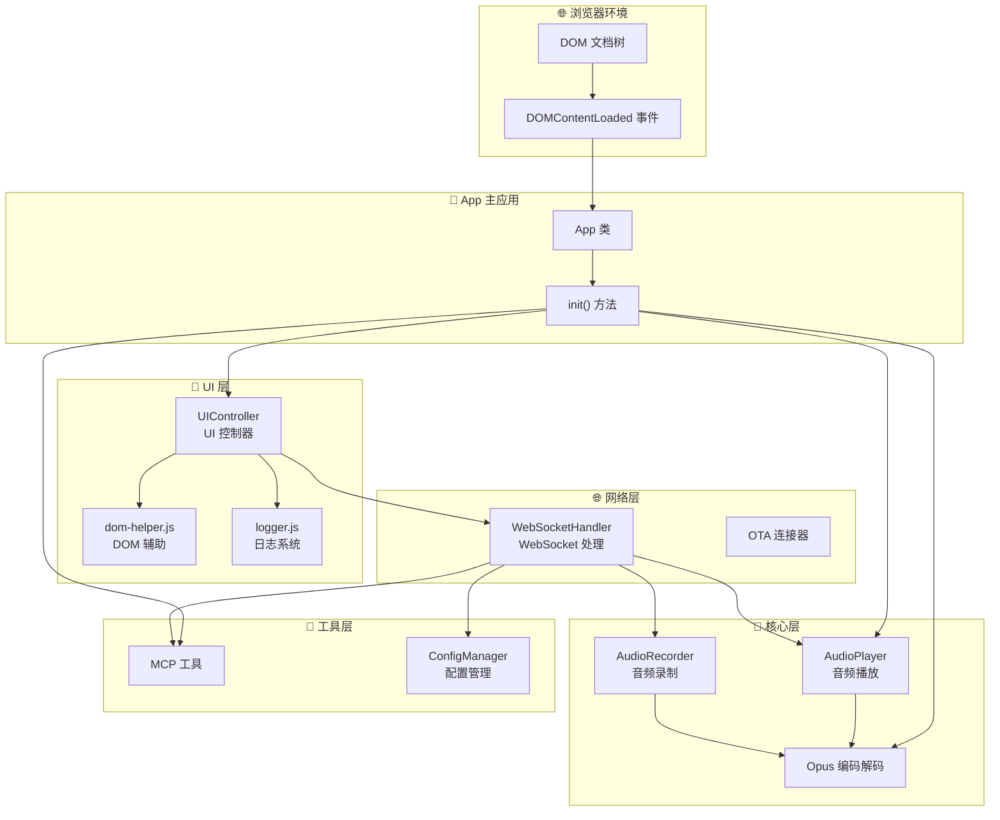

### 1.5.3 应用初始化流程

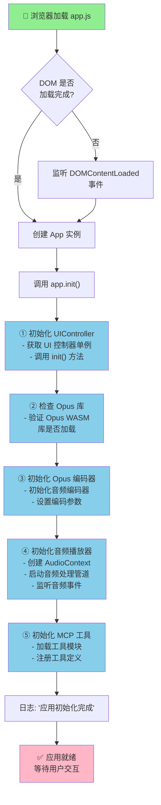

### 1.5.4 数据流框图

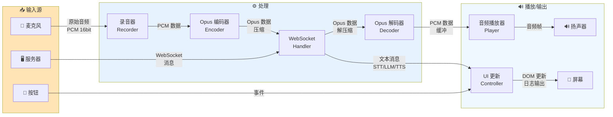

### 1.5.5 App 类设计

#### 核心属性
```javascript
class App {
    uiController = null;      // UI 控制器实例
    audioPlayer = null;       // 音频播放器实例
}
```

#### 初始化顺序
初始化顺序遵循以下原则：
1. **UI 框架优先**: 确保用户界面可用
2. **音频基础设施**: 设置编码/解码能力
3. **音频处理**: 启动音频播放管道
4. **工具系统**: 加载可用工具

#### 单例管理
```javascript
const app = new App();  // 全局唯一实例
export default app;     // 导出供其他模块使用
```

### 1.5.6 启动事件处理

```javascript
if (document.readyState === 'loading') {
    // DOM 仍在加载，等待事件
    document.addEventListener('DOMContentLoaded', () => app.init());
} else {
    // DOM 已加载，直接初始化
    app.init();
}
```

这种处理方式确保：
- 如果脚本在 DOM 解析过程中加载，则等待完成
- 如果脚本在 DOM 加载完成后加载，则立即初始化
- 避免 DOM 元素未就绪导致的错误

### 1.5.7 模块间的交互流程

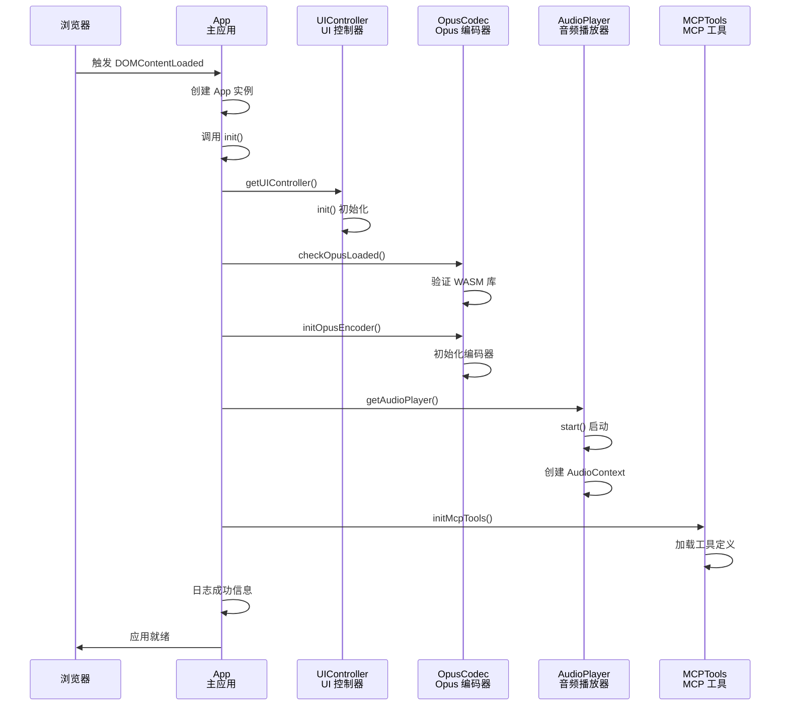

### 1.5.8 错误处理

- **DOM 加载检查**: 根据 `document.readyState` 动态处理
- **Opus 库验证**: 检查 WASM 库是否正确加载
- **异步初始化**: 音频播放器使用 `await` 确保异步操作完成
- **日志记录**: 所有关键步骤记录日志便于调试

### 1.5.9 架构特点

- **模块化设计**: 各模块独立，通过单例模式管理
- **延迟初始化**: 按需初始化，避免阻塞主线程
- **事件驱动**: 事件驱动的初始化流程
- **可扩展性**: 易于添加新模块到初始化流程
- **错误隔离**: 各模块初始化错误不影响其他模块

该入口文件是整个应用的骨架，协调各个子系统的启动，为后续用户交互奠定基础。


